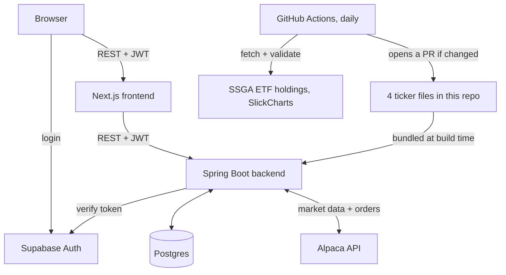
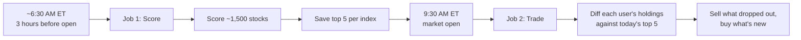
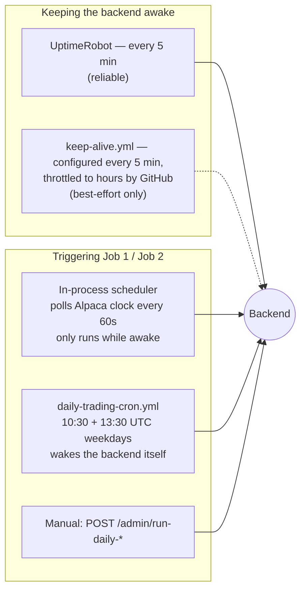
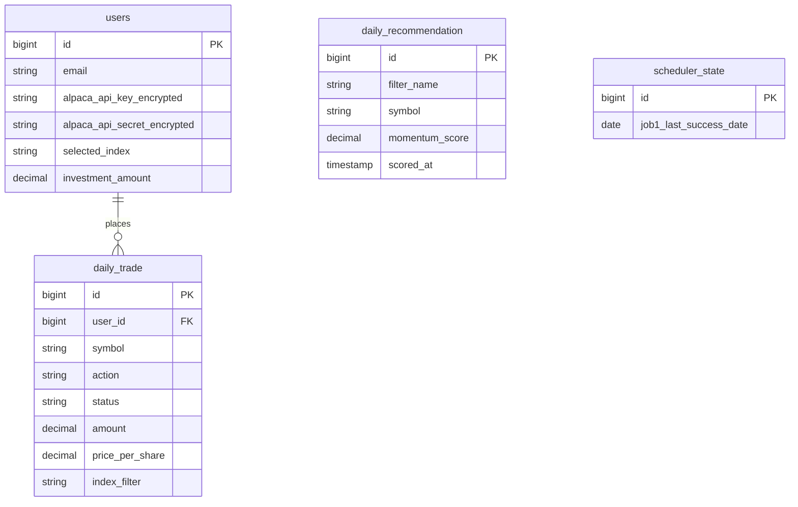

# Architecture

Deep-dive documentation for the Momentum Trading System. See [README.md](README.md) for the short version.

## System architecture



The frontend never talks to Alpaca or Postgres directly. Everything goes through the backend, which checks the caller's Supabase token on every request. Index constituent data doesn't come from a live API call at request time at all — it's four text files built into the backend, kept current by a separate scheduled job. More on why below.

## Daily trading engine flow

Two jobs run automatically every trading day. Neither runs on a fixed clock time — both are driven off Alpaca's own market calendar, because market open shifts around holidays and I didn't want a hardcoded 9:30 AM breaking every time there's a holiday schedule.



A background poller checks Alpaca's clock every 60 seconds. Job 1 fires once, somewhere in the 3-hour window before open — a window, not one exact minute, so a slow poll can't cause the whole day to get skipped. Job 2 fires once, right at open, but only if Job 1 actually succeeded that same day. If scoring failed or never ran, trading sits out rather than rebalancing against yesterday's data.

### Scheduling and keep-alive layers

That background poller only works while the backend process is actually running — and Render's free tier spins the process down after ~15 minutes idle. So there's more than one thing making sure the daily engine actually fires, and more than one thing trying to keep the backend awake in the first place. Worth being explicit about which parts of this are load-bearing and which are best-effort:



`daily-trading-cron.yml` is the one that actually matters most: it doesn't depend on the backend already being awake (the HTTP call itself wakes Render), and it doesn't depend on `keep-alive.yml` working. The in-process scheduler and manual triggers are backups on top of that, not the primary path.

This redundancy is safe specifically because rebalancing is idempotent: `DailyTradingService.rebalanceUser` diffs each user's *live* Alpaca positions against today's top 5 every time it's called, not against some internal "did I already do this" flag. If two triggers fire close together, the second one just finds nothing left to do. Overlapping triggers were a deliberate design choice, not an oversight — see "Challenges faced" below for why one of the two keep-alive mechanisms turned out not to be trustworthy on its own.

## Momentum algorithm

For every stock, using 6 months of split-adjusted daily bars:

```
score = 0.5 × return_6m + 0.3 × return_3m + 0.2 × return_1m − 0.1 × volatility_3m
```

- **return_6m / return_3m / return_1m** — percent price change over each window. This is the trend.
- **volatility_3m** — standard deviation of daily returns over the last 3 months. This is the risk penalty. A stock that's been jumping around a lot gets docked, even if the trend is up.

Two real stocks, scored on a real run this week:

| Symbol | 6m return | 3m return | 1m return | 3m volatility | Score |
|---|---|---|---|---|---|
| MRNA | +160.9% | +205.7% | +170.1% | 0.232 | **1.7385** |
| MXL | +294.6% | −20.8% | −10.6% | 0.084 | **1.3808** |

I picked these two and recomputed the formula by hand against the raw Alpaca bar data to check the stored score matched. It did, to six decimal places. MXL is the more interesting one — a huge 6-month gain but negative momentum over the last 1 and 3 months. The formula still ranks it above stocks with a smoother but smaller trend, because the 6-month term carries half the weight. Whether that's the right call is a fair question — it's a simple weighted formula, not a claim that it's optimal.

Before scoring, a stock has to clear two checks: at least 3 months of price history (a newly listed stock with two weeks of data would get its short window treated as a full 6-month return otherwise), and the run itself has to score at least 90% of the ~1,500-stock universe or the whole run gets thrown out. A real run this week scored 1,515 of 1,520 tracked stocks — comfortably clear of that floor.

## Database schema



Only `daily_trade` links to `users` — every trade belongs to someone. `daily_recommendation` is global: it's today's top 5 for each index, the same for every user, wiped and rewritten each morning. `scheduler_state` is a single row that survives restarts (why that matters is below).

## API endpoints

Every route needs a Supabase JWT in `Authorization: Bearer <token>`, except `/admin/**`, which needs `X-Admin-Key` instead.

| Method | Endpoint | What it does |
|---|---|---|
| GET | `/me` | Current user, auto-created on first call |
| PUT | `/users/me/alpaca-key` | Save or replace the Alpaca key |
| PUT | `/users/me/investment-amount` | Set how much to invest per rebalance |
| POST | `/users/me/selected-index` | Change tracked index, sells + rebuys if the market's open |
| GET | `/recommendations/snp500` | Today's top 5, S&P 500 |
| GET | `/recommendations/sp400` | Today's top 5, S&P 400 |
| GET | `/recommendations/sp600` | Today's top 5, S&P 600 |
| GET | `/recommendations/nasdaq100` | Today's top 5, Nasdaq 100 |
| GET | `/recommendations/full-market` | Today's top 5 across the whole scored universe |
| GET | `/:userId/account` | Live cash, buying power, portfolio value |
| GET | `/:userId/positions` | Live positions from Alpaca |
| GET | `/:userId/daily-trades` | This user's trade history |
| GET | `/metrics` | Health, last scoring run, trade counts |
| POST | `/admin/run-daily-scoring` | Manually trigger Job 1 |
| POST | `/admin/run-daily-trading` | Manually trigger Job 2 |

Every `:userId` route checks that the caller's token actually belongs to that user. That wasn't always true — see below.

`/metrics` is read-only and JWT-authenticated like everything else — it used to live under `/admin/`, but the frontend has no secure place to hold `X-Admin-Key` (anything shipped in client JS is readable by anyone via devtools), so that key stays reserved for the two routes that actually place orders.

## Key technical decisions

**Spring Boot over a lighter framework.** I needed `@Scheduled` polling and a mature JPA layer for the trade audit trail, and Alpaca's official SDK is Java. Fighting the ecosystem to save startup time wasn't worth it for a background job service.

**Postgres through Supabase, not a separate auth provider.** I needed real foreign keys and transactions — the atomic-write fix below depends on them — and I didn't want to build password reset flows and session handling myself. Supabase gives me both a real Postgres database and auth under one project.

**Alpaca for both data and execution.** Scoring and trading both read from the same API. If I'd pulled prices from one provider and traded through another, a price mismatch between the two becomes a silent correctness bug instead of an obvious one.

**React Query on the frontend.** Every mutation — buy, sell, switch index — changes account state that three other parts of the UI depend on: positions, recommendations, the dashboard. Query invalidation after a mutation is a built-in pattern in React Query. Rolling my own cache invalidation for that many dependent views wasn't worth it.

**Text files instead of a live API for index membership.** Covered in full below, but the short version: I stopped trusting any external source to be up when my scheduler runs, and stopped trusting the running app to fetch this data correctly at all.

**Three overlapping ways to trigger the daily engine, on purpose.** The in-process scheduler alone isn't enough — it can only run while the process is awake, and a free-tier backend doesn't stay awake on its own. Rather than trust one keep-alive mechanism to solve that, `daily-trading-cron.yml` triggers the actual jobs directly and wakes the backend itself in the process, independent of whether anything else kept it warm. This only works safely because rebalancing is idempotent by design (see the scheduling diagram above) — redundant triggers can't cause redundant trades.

**A restrained accent color instead of the default theme.** The frontend shipped on shadcn's unmodified grayscale palette for most of this project — functional, but indistinguishable from any other prototype. I picked one deliberate accent (a blue, `oklch(0.623 0.214 259.815)`) for interactive elements, and reserved green/red/amber exclusively for gain/loss/pending states so the two color systems can't collide. `lightweight-charts` (TradingView's open-source charting library) went in for the one chart the dashboard actually has real data for — a small, deliberate scope, not a general-purpose charting setup.

## Challenges faced and how I solved them

**The index constituent problem.** I originally pulled S&P 500/400/600 and Nasdaq 100 constituent lists from four different community GitHub repos, fetched live every day. During a review I found the Nasdaq 100 source had gone 224 days without a single commit — not stale data, an abandoned repo. I looked at switching to Wikipedia and found its Nasdaq-100 page doesn't even have a constituent table anymore, which is probably why the original scraper broke and nobody noticed. I stopped fetching this data at runtime entirely. Now it's four text files committed to this repo, read straight off the classpath, no network call involved. A GitHub Actions job runs daily, pulls from State Street's own official ETF holdings disclosures for the S&P indexes and SlickCharts for Nasdaq 100, and opens a pull request if anything changed. Nothing auto-merges. If a source breaks now, I see a failed CI run — the live app never notices, because it was never involved.

**Performance.** The first version scored every active US stock — around 13,400 of them — every day. Runs took anywhere from 76 to over 370 seconds, and the variance alone made me distrust the number. But the app only ever recommends from four indexes, roughly 1,500 unique tickers after removing overlap. I cut the universe down to that, fetched bars in batches of 200 symbols per request instead of one at a time, and ran the batches in parallel. Real runs now finish in under a minute.

**The IDOR bug.** I was auditing the API surface and noticed `/{userId}/account`, `/{userId}/trade/buy`, and every other `:userId` route trusted the number in the URL with no check against who was actually logged in. Any authenticated user could read or trade on any other user's account by changing one digit. The JWT filter was validating tokens but throwing away the identity it resolved — it never reached the controllers. I fixed it by storing the resolved email as the request's security principal and adding an ownership check to every route that takes a `userId`. I verified it by creating two real throwaway accounts and confirming user A got a 403 touching user B's data, and that A's own requests still worked.

**Atomic writes.** The scoring job replaces yesterday's recommendations by deleting every row and inserting the new ones — two separate database calls. They weren't wrapped in one transaction. A crash between the delete and the insert would leave the table completely empty instead of keeping yesterday's data, which was the entire point of having a "keep old data on failure" safeguard elsewhere in the same method. I wrapped both calls in a single transaction. To check it actually worked, I ran the exact failure case against the real database — delete, then a deliberately broken insert, both inside one transaction — and confirmed the original rows were still there after the rollback.

**Market timing.** `@Scheduled(cron = ...)` needs a fixed time, and market open isn't fixed — it moves around holidays. I built a poller that checks Alpaca's live clock every 60 seconds instead. It also turned out the "did Job 1 run today" flag only lived in memory. A restart between Job 1 succeeding and Job 2 firing would silently skip the entire trading day for every user, with nothing in the logs to explain why. I moved that state into a database row that gets reloaded on startup.

**A read-only endpoint that needed a write-capable secret it couldn't have.** The dashboard's metrics page called `/admin/metrics`, gated by `X-Admin-Key` — the same secret that guards actual order placement. The frontend had no secure way to hold that key (anything shipped in client JS is readable by anyone via devtools), so the page just silently failed every time, and had been broken since the day that endpoint got locked down. The fix wasn't to give the frontend the key — that would have undone the point of gating it in the first place. I split the read-only stats onto a new `/metrics` endpoint behind plain JWT auth, same as every other user-facing route, and left the two genuinely dangerous routes (`run-daily-scoring`, `run-daily-trading`) as the only things `X-Admin-Key` still protects.

**Metrics that forgot themselves on every restart.** Separately, the algorithm-status data on that same metrics page — last run time, status, stocks scored — lived entirely in memory, explicitly documented as intentional ("reflects live process state, not a historical audit log") when it was first built. That was a reasonable call for a service that stays up. It stopped being reasonable once I confirmed how often Render actually restarts this one (see the next item) — every restart wiped a genuinely successful run back to looking like it had never happened. I added a fallback: when the in-memory tracker has nothing to say, the endpoint now derives status and last-run time from the most recent `daily_recommendation.scored_at` instead, since that part is actually persisted. Live in-memory state is still preferred when a process instance actually has it — that part can't be reconstructed from the database.

**Discovering GitHub Actions doesn't run 5-minute schedules on 5-minute schedules.** I built a `keep-alive.yml` workflow to ping the backend every 5 minutes, `cron: "*/5 * * * *"`, and it looked fine — the run history showed green the whole way down. Then I actually measured the gaps between consecutive runs: 2:49, 2:20, 2:07, 4:49 hours. Not minutes — hours. GitHub deprioritizes high-frequency scheduled workflows on repos without constant Actions activity, and there's no configuration fix for that on our side; the cron expression itself is correct, GitHub just doesn't honor it reliably at that frequency. I found this by measuring real behavior, not by reading docs — the workflow's own success/failure status gave no hint anything was wrong, because each individual run genuinely did succeed, just far less often than configured. The fix was accepting that GitHub Actions can't do this job on its own: UptimeRobot (an external service not subject to GitHub's scheduler) now handles the actual 5-minute keep-alive, and `keep-alive.yml` stays in as a best-effort second layer, documented honestly as such rather than implied to be reliable.

**One more, smaller but real: buy-sizing math.** When a stock rotated out of someone's top 5 and a new one rotated in, the new one was sized using the full day's investment amount divided by however many stocks were new that day — not divided by 5. One new stock replacing one old one meant the new position got sized as if it were the only holding, instead of matching the other four. Fixed by always dividing by the full target count, not just the count of what's new.

## Keeping the server awake

Render's free tier spins the backend down after about 15 minutes with no traffic. The daily engine's own scheduler is an in-process poller — it can only check the market clock while the JVM is actually running, so if the server is asleep during a given day's 3-hour scoring window, that window can pass with nobody home and the whole trading day gets silently skipped. Two things address this, and they are not equally reliable — see the diagram and challenge entry above for why.

**1. External cron (GitHub Actions)**

`.github/workflows/daily-trading-cron.yml` calls the two admin endpoints directly on a schedule, weekdays only:

- `10:30 UTC` (6:30 AM ET) — `POST /admin/run-daily-scoring`
- `13:30 UTC` (9:30 AM ET) — `POST /admin/run-daily-trading`

GitHub runs this regardless of whether the backend is currently awake — the HTTP call itself wakes Render up. If either call fails, the workflow run shows red in the Actions tab and GitHub emails a failure notification automatically. It can also be triggered manually anytime from the Actions tab (`workflow_dispatch`), with a choice of running scoring, trading, or both.

To set it up, add `ADMIN_SECRET_KEY` as a repository secret:

1. Go to the repo on GitHub → **Settings** → **Secrets and variables** → **Actions**
2. Click **New repository secret**
3. Name: `ADMIN_SECRET_KEY`
4. Value: the same value set as the backend's `ADMIN_SECRET_KEY` environment variable on Render
5. Save

**2. Keep-alive (GitHub Actions) — has a known reliability gap**

`.github/workflows/keep-alive.yml` is *configured* to ping the backend every 5 minutes, 24/7/365. In practice, measured against the real run history, it doesn't actually fire every 5 minutes — gaps of 2-5 hours between runs are normal. This is GitHub's own platform behavior, not a bug in this workflow: GitHub explicitly deprioritizes high-frequency (`*/5`) scheduled workflows on repos without constant Actions activity, and there's no config on our side that fixes it. Treat this workflow as "helps sometimes," not "guarantees the server stays warm" — **UptimeRobot below is the actually-reliable option** if you need real 5-minute pings.

This also lets the backend's own in-process scheduler work as a redundant backup path when it does fire, since that scheduler can only tick while the process is actually awake. Failures are silent by design (a missed ping just means the next one fires whenever GitHub actually runs it) — this isn't meant to page anyone, unlike the trading cron above.

To set it up, add `BACKEND_URL` as a repository secret the same way as `ADMIN_SECRET_KEY`:

1. Go to the repo on GitHub → **Settings** → **Secrets and variables** → **Actions**
2. Click **New repository secret**
3. Name: `BACKEND_URL`
4. Value: the Render backend URL (e.g. `https://momentum-trading-backend.onrender.com`)
5. Save

**Alternative — UptimeRobot (the reliable one).** [uptimerobot.com](https://uptimerobot.com) offers the same 5-minute HTTP ping as a free hosted service, and unlike GitHub Actions, it actually delivers on that interval: create an account, **Add New Monitor**, type **HTTP(s)**, paste the backend URL, set the interval to 5 minutes, save. This is what actually keeps the backend warm in production; the GitHub Actions version above is a backup, not the primary mechanism.
