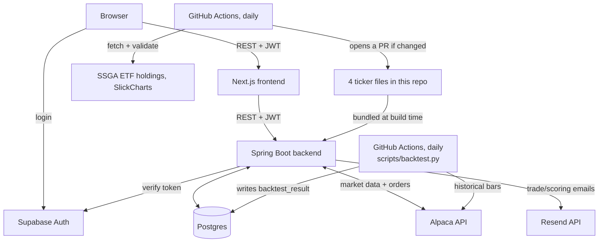
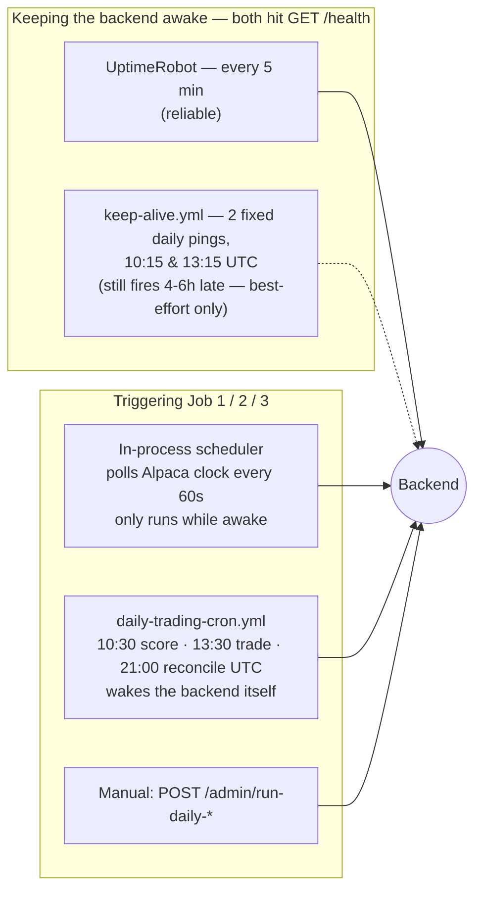
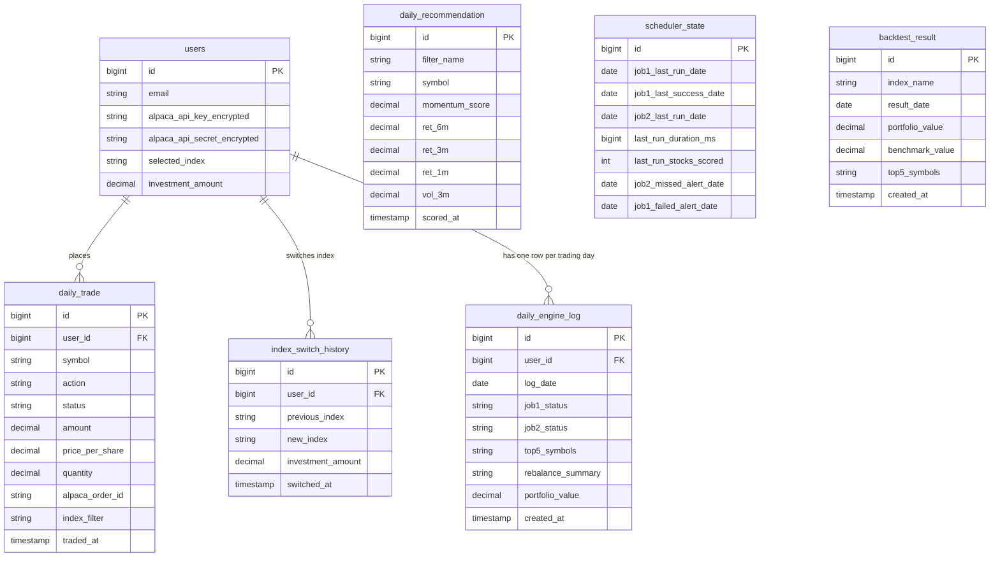
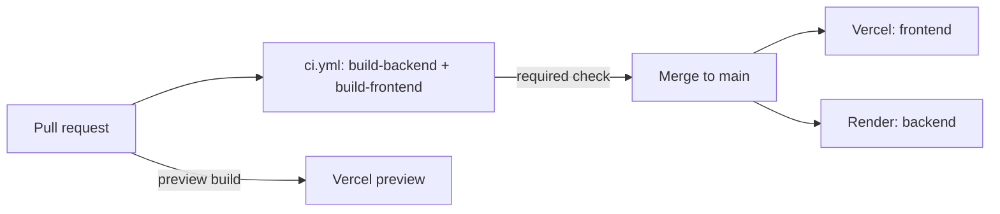

# Architecture

Deep-dive documentation for the Momentum Trading System. See [README.md](README.md) for the short version.

## System architecture



The frontend never talks to Alpaca, Postgres, or Resend directly. Everything goes through the backend, which checks the caller's Supabase token on every request. Index constituent data doesn't come from a live API call at request time at all — it's four text files built into the backend, kept current by a separate scheduled job. More on why below. Email is a one-way, fire-and-forget HTTPS call — the backend never waits on a delivery confirmation to decide whether a trading run succeeded, and a failed send is logged and tracked, never allowed to fail the run it's reporting on. The backtest job is the one exception to "the backend is the only thing that touches Postgres" — it's a separate Python process that reads Alpaca and writes straight to the database; the backend only ever reads what it stored (see Backtest below).

## Daily trading engine flow

Three jobs run automatically every trading day. The first two aren't on a fixed clock time — they're driven off Alpaca's own market calendar, because market open shifts around holidays and I didn't want a hardcoded 9:30 AM breaking every time there's a holiday schedule. The third runs at a plain fixed time, since it just needs to happen well after close.

```mermaid
flowchart LR
    A["~6:30 AM ET<br/>3 hours before open"] --> B[Job 1: Score]
    B --> C[Score ~1,500 stocks]
    C --> D[Save top 5 per index]
    D --> E["9:30 AM ET<br/>market open"]
    E --> F[Job 2: Trade]
    F --> G[Diff each user's holdings<br/>against today's top 5]
    G --> H[Sell what dropped out,<br/>buy what's new]
    H --> I["~4-5 PM ET<br/>after close"]
    I --> J[Job 3: Reconcile]
    J --> K[Check Alpaca for any trade<br/>still stuck PENDING]
```



A background poller checks Alpaca's clock every 60 seconds. Job 1 retries every 15 minutes within the 3-hour window before open, until it succeeds — a single transient failure (an Alpaca hiccup, a brief DB blip) gets more chances within the same window instead of silently skipping scoring for the entire day. If the window closes without ever succeeding, every eligible user gets a "Scoring Failed Today" email. Job 2 then retries every 15 minutes for as long as the market stays open, but only proceeds once Job 1 has actually succeeded that same day — if scoring never managed to complete, trading sits out rather than rebalancing against yesterday's data. Job 3 runs on a plain cron at 21:00 UTC — no clock-polling needed, since it doesn't care exactly when the market closed, just that it did.

Job 3 exists because an order can outlive the code watching it. Job 2 waits about 24 seconds for each order to confirm a fill before moving on, so one slow order can't stall the whole run — but the order keeps executing on Alpaca's side either way. Anything still marked PENDING gets checked against Alpaca's own order record once daily and moved to FILLED or FAILED, so the trade history doesn't permanently show "pending" for something that resolved hours ago.

### Scheduling and keep-alive layers

That background poller only works while the backend process is actually running — and Render's free tier spins the process down after ~15 minutes idle. So there's more than one thing making sure the daily engine actually fires, and more than one thing trying to keep the backend awake in the first place. Worth being explicit about which parts of this are load-bearing and which are best-effort:



`/health` is a plain, public endpoint — no Supabase JWT required — added specifically so a ping can get a real `200 {"status":"UP"}` back instead of the `401` every other route returns. The 401 still reached the server and reset Render's idle timer either way, but a real 200 is easier to trust when checking whether a monitor is actually working.

`daily-trading-cron.yml` is the one that actually matters most: it doesn't depend on the backend already being awake (the HTTP call itself wakes Render), and it doesn't depend on `keep-alive.yml` working. The in-process scheduler and manual triggers are backups on top of that, not the primary path.

This redundancy is safe specifically because rebalancing is idempotent: `DailyTradingService.rebalanceUser` diffs each user's *live* Alpaca positions against today's top 5 every time it's called, not against some internal "did I already do this" flag. If two triggers fire close together, the second one just finds nothing left to do. Overlapping triggers were a deliberate design choice, not an oversight — see "Challenges faced" below for why one of the two keep-alive mechanisms turned out not to be trustworthy on its own.

## Momentum algorithm

For every stock, using 6 months of split-adjusted daily bars:

```
score = 0.5 × return_6m + 0.3 × return_3m + 0.2 × return_1m − 0.1 × volatility_3m
```

- **return_6m / return_3m / return_1m** — percent price change over each window. This is the trend.
- **volatility_3m** — standard deviation of daily returns over the last 3 months. This is the risk penalty. A stock that's been jumping around a lot gets docked, even if the trend is up.

Two real stocks, scored on a real run this week:

| Symbol | 6m return | 3m return | 1m return | 3m volatility | Score |
|---|---|---|---|---|---|
| MRNA | +160.9% | +205.7% | +170.1% | 0.232 | **1.7385** |
| MXL | +294.6% | −20.8% | −10.6% | 0.084 | **1.3808** |

I picked these two and recomputed the formula by hand against the raw Alpaca bar data to check the stored score matched. It did, to six decimal places. MXL is the more interesting one — a huge 6-month gain but negative momentum over the last 1 and 3 months. The formula still ranks it above stocks with a smoother but smaller trend, because the 6-month term carries half the weight. Whether that's the right call is a fair question — it's a simple weighted formula, not a claim that it's optimal.

Before scoring, a stock has to clear two checks: at least 3 months of price history (a newly listed stock with two weeks of data would get its short window treated as a full 6-month return otherwise), and the run itself has to score at least 90% of the ~1,500-stock universe or the whole run gets thrown out. A real run this week scored 1,515 of 1,520 tracked stocks — comfortably clear of that floor.

## Backtest

A separate daily job, entirely outside the Spring Boot app: `scripts/backtest.py`, run by `.github/workflows/backtest.yml`. It walks forward across the last 2 years, applying the exact formula above to every historical trading day instead of just today, ranking each index's constituents and simulating an equal-weighted portfolio that rebalances to that day's top 5 every day — compared against the relevant benchmark ETF compounding its own real daily returns over the same range.

First run per index backfills 2 years; every run after picks up from that index's own last stored day and last stored value, fetching only the trailing lookback window the formula needs plus whatever's new — never refetching or recomputing the full range again. Computed with pandas, vectorized across every (day, symbol) pair at once rather than a line-by-line port of the Java loop — at this scale (~1,500 stocks × ~500 trading days × 5 indexes) a naive per-day recomputation would be too slow to run as a daily job. Validated against a naive per-date reimplementation of the same formula for exact numeric parity on real data before being finalized.

Only a normalized cumulative-return index is ever computed or stored — both series start at 100, never a dollar amount for any specific investment. `GET /backtest/{index}` (JWT-authenticated, same as `/recommendations`) serves the stored series as-is; the Backtest page turns it into real dollar figures entirely client-side, scaled by whatever starting amount the user enters.

Benchmark ETFs: `SPY` (S&P 500), `MDY` (S&P 400), `SPSM` (S&P 600), `QQQ` (Nasdaq 100), `VTI` (Full Market) — its own mapping, separate from the one the live Dashboard benchmark-comparison card uses (`IndexConstituentService.INDEX_TO_ETF`), which has no `FULL_MARKET` entry but agrees on `SPSM` for S&P 600.

Needs its own repository secrets to run — `ALPACA_SYSTEM_API_KEY`, `ALPACA_SYSTEM_API_SECRET`, `DB_URL`, `DB_USERNAME`, `DB_PASSWORD` — same values already set as Render environment variables, added separately the same way as `ADMIN_SECRET_KEY` (see "Keeping the server awake" below).

## Database schema



`daily_trade`, `index_switch_history`, and `daily_engine_log` all link to `users` — every trade, index switch, and daily log entry belongs to someone, and `index_switch_history` records the amount actually in effect at switch time, not whatever it's since changed to. `daily_recommendation` is global: it's today's top 5 for each index, the same for every user, wiped and rewritten each morning. The four `ret_*`/`vol_3m` columns are the momentum formula's own inputs, stored alongside the score so the recommendations table can show the breakdown, not just the final number.

`backtest_result` is also global, like `daily_recommendation` — no user link, one row per `(index_name, result_date)`, written only by `scripts/backtest.py` (see Backtest above), never by the Spring Boot app itself.

`daily_engine_log` is one row per user per trading day (unique on `user_id` + `log_date`), written by both Job 1 and Job 2 regardless of outcome — a plain "no rebalance needed" day gets a row just like a day with real trades, and so does a failure. `rebalance_summary` is a one-line plain-English description ("Bought SNDK, MU. Sold INTC, PANW.") kept alongside the machine-readable status. This table is also what Trade History uses to fill in a day that ran but placed zero trades — market closed, holdings already matched, or a genuine failure — instead of that day just showing up blank, indistinguishable from a day nothing ever ran at all.

`scheduler_state` is a single row that survives restarts. `job2_last_run_date` is the real guard against re-running Job 2 twice on the same day no matter which of the three trigger paths (in-process poller, external cron, manual) fires first; `job2_missed_alert_date` makes sure the "trading window missed" email only ever sends once per day, not once per retry. `job1_failed_alert_date` is the same once-per-day guard for the "scoring failed today" email. `last_run_duration_ms` and `last_run_stocks_scored` exist so the metrics page still shows real numbers after a restart wipes the in-memory tracker.

## API endpoints

Every route needs a Supabase JWT in `Authorization: Bearer <token>`, except `/admin/**` (see Operational Controls below) and `/health` (needs nothing at all).

| Method | Endpoint | What it does |
|---|---|---|
| GET | `/health` | Public liveness check, no auth — `{"status":"UP"}` |
| GET | `/me` | Current user, auto-created on first call |
| PUT | `/users/me/alpaca-key` | Save or replace the Alpaca key |
| PUT | `/users/me/investment-amount` | Set how much to invest per rebalance |
| POST | `/users/me/selected-index` | Change tracked index, sells + rebuys if the market's open |
| GET | `/users/me/index-switch-history` | Every past index switch, most recent first |
| GET | `/recommendations/snp500` | Today's top 5, S&P 500 |
| GET | `/recommendations/sp400` | Today's top 5, S&P 400 |
| GET | `/recommendations/sp600` | Today's top 5, S&P 600 |
| GET | `/recommendations/nasdaq100` | Today's top 5, Nasdaq 100 |
| GET | `/recommendations/full-market` | Today's top 5 across the whole scored universe |
| GET | `/backtest/snp500` | 2-year walk-forward simulation vs. benchmark, S&P 500 |
| GET | `/backtest/sp400` | 2-year walk-forward simulation vs. benchmark, S&P 400 |
| GET | `/backtest/sp600` | 2-year walk-forward simulation vs. benchmark, S&P 600 |
| GET | `/backtest/nasdaq100` | 2-year walk-forward simulation vs. benchmark, Nasdaq 100 |
| GET | `/backtest/full-market` | 2-year walk-forward simulation vs. benchmark, Full Market |
| GET | `/index-price-history` | 30-day price history for an index's tracking ETF |
| GET | `/stock-price-history` | 14-day price history for a list of symbols (sparklines) |
| GET | `/:userId/account` | Live cash, buying power, portfolio value |
| GET | `/:userId/positions` | Live positions from Alpaca |
| GET | `/:userId/daily-trades` | This user's trade history |
| GET | `/:userId/engine-log` | This user's `daily_engine_log` rows, for filling calendar gaps in Trade History |
| GET | `/:userId/benchmark` | Portfolio return vs. tracked index return, same period |
| GET | `/engine-status` | Whether today is a trading day and whether Job 1 / Job 2 have run |
| GET | `/metrics` | Health, last scoring run, trade counts |

Every `:userId` route checks that the caller's token actually belongs to that user. That wasn't always true — see below.

`/metrics` is read-only and JWT-authenticated like everything else — it used to live under `/admin/`, but the frontend has no secure place to hold `X-Admin-Key` (anything shipped in client JS is readable by anyone via devtools), so that key stays reserved for the routes below that actually touch Alpaca orders or trigger a run.

## Operational Controls

Not part of the public API — these exist for running and debugging the daily engine by hand, gated by a separate `X-Admin-Key` header instead of a user's Supabase JWT, since there's no user behind these calls at all (a person with repo/deploy access, or `daily-trading-cron.yml`, calling them directly).

| Method | Endpoint | What it does |
|---|---|---|
| POST | `/admin/run-daily-scoring` | Manually trigger Job 1 |
| POST | `/admin/run-daily-trading` | Manually trigger Job 2 |
| POST | `/admin/reconcile-pending-trades` | Manually trigger Job 3 |
| POST | `/admin/test-email` | On-demand send to confirm Resend is actually delivering |

None of these are needed for the system to run correctly day to day — Job 1/2/3 all fire on their own schedule regardless (see "Daily trading engine flow" above). These are for exactly two situations: `daily-trading-cron.yml` calling them as an external backup trigger (see "Keeping the server awake" below), and manually forcing a run or checking email deliverability while debugging something live.

## Frontend

Six pages behind login: Dashboard, Positions, Recommendations, Backtest, Settings, System Metrics. Every timestamp anywhere in the app shows both IST and ET side by side — "4:01 PM IST (6:31 AM ET)" — since backend timestamps are UTC and the person who built this and the market this trades in are in different timezones from each other. Light and dark themes are both fully defined, not a dark-only app with a toggle bolted on; the switch lives in the sidebar and persists across sessions.

**Dashboard.** Portfolio value with today's change, a benchmark comparison (your return vs. the tracked index's return over the same period, pulled from Alpaca's own portfolio history endpoint so it's not something computed by hand from the trade log), a donut chart of what you're holding, live positions, algorithm status, the tracked index's 30-day price, today's top 5 with a sparkline per stock, and trade history — grouped by day, 20 most recent with a load-more button, not truncated to a fixed number with no way to see older trades.

**Backtest.** Same index tabs as Recommendations. A dual-line chart (momentum strategy vs. benchmark ETF), three stats (total return, benchmark return, out/underperformance), and a plain number input for a starting amount — every dollar figure on the page is computed from the stored percentage curve the moment that number changes, entirely client-side. An (i) icon next to every stat and the chart title explains what it means in plain language.

**Settings.** Connect an Alpaca key, set an investment amount, pick an index. Switching index sells everything currently held and buys the new index's top 5, with a confirmation dialog first since it's a real action with consequences. A Switch History table below the picker shows every past switch — previous index, new index, the dollar amount that was actually in effect at that moment, and when.

**Positions.** The same live Alpaca data as the dashboard's positions card, as its own page with more room.

**Failure handling.** Every data-fetching card checks for a failed request specifically, not just loading vs. loaded — a card that failed to fetch shows its own error state instead of quietly rendering as if the account just has nothing in it, which used to be indistinguishable from a real backend outage. The initial user-session check (`/me`, on login and on every Supabase auth-state change) retries up to 5 times with a delay before giving up, since a Render cold start can take 60-100+ seconds and a single failed attempt used to leave the whole app stuck on "Loading account…" forever with no way out except a manual page refresh. If it still fails after retrying, the user gets an explicit connection-error message and a "Try again" button instead of a silent, permanent blank state.

## Key technical decisions

**Spring Boot over a lighter framework.** I needed `@Scheduled` polling and a mature JPA layer for the trade audit trail, and Alpaca's official SDK is Java. Fighting the ecosystem to save startup time wasn't worth it for a background job service.

**Postgres through Supabase, not a separate auth provider.** I needed real foreign keys and transactions — the atomic-write fix below depends on them — and I didn't want to build password reset flows and session handling myself. Supabase gives me both a real Postgres database and auth under one project.

**Alpaca for both data and execution.** Scoring and trading both read from the same API. If I'd pulled prices from one provider and traded through another, a price mismatch between the two becomes a silent correctness bug instead of an obvious one.

**React Query on the frontend.** Every mutation — buy, sell, switch index — changes account state that three other parts of the UI depend on: positions, recommendations, the dashboard. Query invalidation after a mutation is a built-in pattern in React Query. Rolling my own cache invalidation for that many dependent views wasn't worth it.

**Text files instead of a live API for index membership.** Covered in full below, but the short version: I stopped trusting any external source to be up when my scheduler runs, and stopped trusting the running app to fetch this data correctly at all.

**Three overlapping ways to trigger the daily engine, on purpose.** The in-process scheduler alone isn't enough — it can only run while the process is awake, and a free-tier backend doesn't stay awake on its own. Rather than trust one keep-alive mechanism to solve that, `daily-trading-cron.yml` triggers the actual jobs directly and wakes the backend itself in the process, independent of whether anything else kept it warm. This only works safely because rebalancing is idempotent by design (see the scheduling diagram above) — redundant triggers can't cause redundant trades.

**A restrained accent color instead of the default theme.** The frontend shipped on shadcn's unmodified grayscale palette for most of this project — functional, but indistinguishable from any other prototype. I picked one deliberate accent (a blue, `oklch(0.623 0.214 259.815)`) for interactive elements, and reserved green/red/amber exclusively for gain/loss/pending states so the two color systems can't collide. Both a light and a dark palette are defined this way, switchable from the sidebar, not just a dark-mode-only app with the toggle removed.

**pandas for the backtest, not a line-by-line port of the Java scoring loop.** The backtest walks the same formula across ~1,500 stocks × ~500 trading days × 5 indexes — recomputing that from scratch per day, the way the live scoring job does for a single day, would be too slow to run daily. Pivoting into a date × symbol price matrix and computing every day's scores at once with vectorized pandas operations instead cut that down to something that actually finishes in a GitHub Actions job. Checked for exact numeric parity against a naive per-date reimplementation of the same formula before trusting the vectorized version.

**lightweight-charts for every chart, nothing else.** TradingView's open-source charting library renders the index price chart, the per-stock sparklines in the recommendations table, and nothing beyond that — no general-purpose charting library pulled in for one-off use cases. The portfolio composition breakdown is a donut, which this library doesn't do, so that one's plain SVG using the same theme tokens instead of a second charting dependency for a single chart type.

## Challenges faced and how I solved them

**The index constituent problem.** I originally pulled S&P 500/400/600 and Nasdaq 100 constituent lists from four different community GitHub repos, fetched live every day. During a review I found the Nasdaq 100 source had gone 224 days without a single commit — not stale data, an abandoned repo. I looked at switching to Wikipedia and found its Nasdaq-100 page doesn't even have a constituent table anymore, which is probably why the original scraper broke and nobody noticed. I stopped fetching this data at runtime entirely. Now it's four text files committed to this repo, read straight off the classpath, no network call involved. A GitHub Actions job runs daily, pulls from State Street's own official ETF holdings disclosures for the S&P indexes and SlickCharts for Nasdaq 100, and opens a pull request if anything changed. Nothing auto-merges. If a source breaks now, I see a failed CI run — the live app never notices, because it was never involved.

**Performance.** The first version scored every active US stock — around 13,400 of them — every day. Runs took anywhere from 76 to over 370 seconds, and the variance alone made me distrust the number. But the app only ever recommends from five tracked options (S&P 500, S&P 400, S&P 600, Nasdaq 100, and Full Market), roughly 1,500 unique tickers after removing overlap. I cut the universe down to that, fetched bars in batches of 200 symbols per request instead of one at a time, and ran the batches in parallel. Real runs now finish in under a minute.

**The IDOR bug.** I was auditing the API surface and noticed `/{userId}/account`, `/{userId}/trade/buy`, and every other `:userId` route trusted the number in the URL with no check against who was actually logged in. Any authenticated user could read or trade on any other user's account by changing one digit. The JWT filter was validating tokens but throwing away the identity it resolved — it never reached the controllers. I fixed it by storing the resolved email as the request's security principal and adding an ownership check to every route that takes a `userId`. I verified it by creating two real throwaway accounts and confirming user A got a 403 touching user B's data, and that A's own requests still worked.

**Atomic writes.** The scoring job replaces yesterday's recommendations by deleting every row and inserting the new ones — two separate database calls. They weren't wrapped in one transaction. A crash between the delete and the insert would leave the table completely empty instead of keeping yesterday's data, which was the entire point of having a "keep old data on failure" safeguard elsewhere in the same method. I wrapped both calls in a single transaction. To check it actually worked, I ran the exact failure case against the real database — delete, then a deliberately broken insert, both inside one transaction — and confirmed the original rows were still there after the rollback.

**Market timing.** `@Scheduled(cron = ...)` needs a fixed time, and market open isn't fixed — it moves around holidays. I built a poller that checks Alpaca's live clock every 60 seconds instead. It also turned out the "did Job 1 run today" flag only lived in memory. A restart between Job 1 succeeding and Job 2 firing would silently skip the entire trading day for every user, with nothing in the logs to explain why. I moved that state into a database row that gets reloaded on startup.

**A read-only endpoint that needed a write-capable secret it couldn't have.** The dashboard's metrics page called `/admin/metrics`, gated by `X-Admin-Key` — the same secret that guards actual order placement. The frontend had no secure way to hold that key (anything shipped in client JS is readable by anyone via devtools), so the page just silently failed every time, and had been broken since the day that endpoint got locked down. The fix wasn't to give the frontend the key — that would have undone the point of gating it in the first place. I split the read-only stats onto a new `/metrics` endpoint behind plain JWT auth, same as every other user-facing route, and left the two genuinely dangerous routes (`run-daily-scoring`, `run-daily-trading`) as the only things `X-Admin-Key` still protects.

**Metrics that forgot themselves on every restart.** Separately, the algorithm-status data on that same metrics page — last run time, status, stocks scored — lived entirely in memory, explicitly documented as intentional ("reflects live process state, not a historical audit log") when it was first built. That was a reasonable call for a service that stays up. It stopped being reasonable once I confirmed how often Render actually restarts this one (see the next item) — every restart wiped a genuinely successful run back to looking like it had never happened. I added a fallback: when the in-memory tracker has nothing to say, the endpoint now derives status and last-run time from the most recent `daily_recommendation.scored_at` instead, since that part is actually persisted. Live in-memory state is still preferred when a process instance actually has it — that part can't be reconstructed from the database.

**Discovering GitHub Actions doesn't run 5-minute schedules on 5-minute schedules.** I built a `keep-alive.yml` workflow to ping the backend every 5 minutes, `cron: "*/5 * * * *"`, and it looked fine — the run history showed green the whole way down. Then I actually measured the gaps between consecutive runs: 2:49, 2:20, 2:07, 4:49 hours. Not minutes — hours. GitHub deprioritizes high-frequency scheduled workflows on repos without constant Actions activity, and there's no configuration fix for that on our side; the cron expression itself is correct, GitHub just doesn't honor it reliably at that frequency. I found this by measuring real behavior, not by reading docs — the workflow's own success/failure status gave no hint anything was wrong, because each individual run genuinely did succeed, just far less often than configured. The fix was accepting that GitHub Actions can't do this job on its own: UptimeRobot (an external service not subject to GitHub's scheduler) now handles the actual 5-minute keep-alive, and `keep-alive.yml` stays in as a best-effort second layer, documented honestly as such rather than implied to be reliable.

**One more, smaller but real: buy-sizing math.** When a stock rotated out of someone's top 5 and a new one rotated in, the new one was sized using the full day's investment amount divided by however many stocks were new that day — not divided by 5. One new stock replacing one old one meant the new position got sized as if it were the only holding, instead of matching the other four. Fixed by always dividing by the full target count, not just the count of what's new.

**A font variable pointing at itself.** `--font-sans: var(--font-sans)` in the theme config — circular, not aliasing the real Geist Sans variable Next.js injects, the same way `--font-mono` correctly does one line below it. A circular CSS variable resolves to invalid, and `font-family: var(--font-sans)` had no fallback list, so the entire app had been rendering in the browser's default font, not Geist Sans. I found it while chasing down a report that a badge looked misaligned next to some text — turned out the badge was fine, the font was wrong, and a fallback font's glyphs just sit at a different height than the one everything was actually designed around. Confirmed by logging into the live site and screenshotting it: every non-monospace element, clearly serif. One-line fix once the actual cause was found.

**A keep-alive ping that only ever got a 401.** Every route required a Supabase JWT except `/admin/**` — including the bare root URL the keep-alive workflow and UptimeRobot were both pinging. The ping still reached the server and reset Render's idle timer (any HTTP request does that, regardless of status code), so it wasn't silently broken, but there was no way to look at a ping's response and confirm it actually worked. Added `/health`, excluded it from both the JWT filter and Spring Security's auth requirement, and pointed both pingers at it instead.

**Alpaca credentials were stored in plaintext.** The columns were named `alpaca_api_key_encrypted` / `alpaca_api_secret_encrypted`, but nothing writing to them ever actually encrypted anything — real Alpaca keys and secrets sitting in the database as plain text, one leaked backup or compromised DB credential away from every connected account being fully exposed. Found this during a full adversarial security pass over the codebase (see below). Fixed with AES-256-GCM, keyed by an `ENCRYPTION_KEY` env var that isn't optional — the app won't start without it. Every encrypted value gets an `enc:v1:` prefix, and decrypting a value with no prefix just passes it through unchanged, so the one real existing user's plaintext key kept working through the deploy instead of needing a hard cutover. Verified by running the migration against production and confirming the `enc:v1:` prefix actually showed up on that user's row in the real database afterward, not just in a local test.

**Email over SMTP just hung, forever, with no error.** Render's free tier blocks outbound SMTP on port 587 entirely. There was no explicit timeout anywhere in the original mail-sending code, so a blocked connection didn't fail fast — it just sat there until Spring's own defaults eventually gave up, and in the meantime every trading/scoring email silently never delivered. Fixed by dropping SMTP and `JavaMailSender` entirely and switching to a plain HTTPS POST against Resend's API — port 443 was never blocked — with a shared `RestTemplate` carrying explicit 5s connect / 10s read timeouts, so a slow or dead connection can now only ever stall for a few seconds, never indefinitely.

**A full adversarial audit, and the three other critical gaps it turned up.** I went through the whole codebase specifically trying to break it, not defend it, and found (beyond the encryption and email issues above): a single failed audit-log write (`daily_engine_log`) could throw an exception that aborted the entire parallel rebalance batch mid-run, potentially skipping every other user still waiting their turn — fixed by wrapping every one of those writes so a logging failure can never take down the trading run it's supposed to be describing. Every outbound `RestTemplate` call (to Supabase, to Resend) had no configured timeout at all, meaning a slow third party could hang a request indefinitely — fixed with one shared `RestTemplate` bean carrying real timeouts, reused everywhere instead of each caller rolling its own. And the frontend's very first `/me` call, if it failed even once (a Render cold start is genuinely slow — 60 to 100+ seconds), left the whole app stuck on "Loading account…" forever, no retry, no error, no way out but a manual refresh — fixed with the retry-then-connection-error behavior described under Frontend above.

**Six more real issues from the same audit.** `UserController` was independently re-verifying every request's token against Supabase a second time, even though `JwtAuthFilter` already resolves and verifies it once per request and stores the result — removed the redundant call, cutting real auth latency on the busiest controller in the app. A brand-new user's very first request had a genuine check-then-insert race: two near-simultaneous first calls for the same new email could both miss the existing-user lookup and both try to insert, and the loser crashed on the database's unique constraint instead of just working — fixed by catching that specific constraint violation and re-reading the row the winner just created. No frontend component checked `isError` on its data fetches, so a real backend failure rendered identically to "this account genuinely has nothing here yet" — added a distinct error state everywhere, so an outage looks like an outage. CORS only allowed one hardcoded production URL, so every single PR preview deployment silently failed to reach the real backend at all — switched to a wildcard scoped to this project's own Vercel deployments. And `buySymbols` could silently no-op after a paired sell had already executed — sold the old position, then quietly failed to buy the replacement (insufficient buying power, most commonly), with the rebalance email and the engine log both just saying nothing was bought, no explanation — fixed by having the buy step return why it skipped, and surfacing that reason in both places instead of swallowing it.

**Trade History used to just go blank.** A day the engine actually ran but placed zero trades — market closed, holdings already matched today's top 5, or Job 2 genuinely failed — produced no row in Trade History at all, which looked identical to a day the system never ran on. Now every calendar day between the earliest known activity and today gets a row: a real trade if one happened, a plain-English summary pulled from `daily_engine_log` if the system ran but had nothing to trade, or an honest "no data — algorithm may not have run" if there's genuinely no record either way. Weekends get their own label instead of reading as an unexplained gap.

## Keeping the server awake

Render's free tier spins the backend down after about 15 minutes with no traffic. The daily engine's own scheduler is an in-process poller — it can only check the market clock while the JVM is actually running, so if the server is asleep during a given day's 3-hour scoring window, that window can pass with nobody home and the whole trading day gets silently skipped. Two things address this, and they are not equally reliable — see the diagram and challenge entry above for why.

**1. External cron (GitHub Actions)**

`.github/workflows/daily-trading-cron.yml` calls the admin endpoints directly on a schedule, weekdays only:

- `10:30 UTC` (6:30 AM ET) — `POST /admin/run-daily-scoring`
- `13:30 UTC` (9:30 AM ET) — `POST /admin/run-daily-trading`
- `21:00 UTC` (4-5 PM ET) — `POST /admin/reconcile-pending-trades`

GitHub runs this regardless of whether the backend is currently awake — the HTTP call itself wakes Render up. If any call fails, the workflow run shows red in the Actions tab and GitHub emails a failure notification automatically. It can also be triggered manually anytime from the Actions tab (`workflow_dispatch`) — scoring, trading, both, or reconciliation on its own.

To set it up, add `ADMIN_SECRET_KEY` as a repository secret:

1. Go to the repo on GitHub → **Settings** → **Secrets and variables** → **Actions**
2. Click **New repository secret**
3. Name: `ADMIN_SECRET_KEY`
4. Value: the same value set as the backend's `ADMIN_SECRET_KEY` environment variable on Render
5. Save

**2. Keep-alive (GitHub Actions) — best-effort backup, not the reliable path**

`.github/workflows/keep-alive.yml` pings the backend at two fixed times a day, weekdays only — `10:15 UTC` and `13:15 UTC`, each timed to land 15 minutes ahead of Job 1 and Job 2 respectively. This isn't its original design: it used to run on `cron: "*/5 * * * *"` (every 5 minutes, 24/7), which GitHub measurably didn't honor — gaps of 2-5 hours between runs were normal, because GitHub deprioritizes high-frequency scheduled workflows on repos without constant Actions activity. Switching to two fixed daily times was meant to work around that, on the theory that GitHub reliably honors a low-frequency, fixed-time schedule even if it won't honor a high-frequency one.

That theory doesn't hold up. Measured against the real run history after the switch, this workflow still fires 4-6 hours late on most days — essentially as unreliable as the `*/5` schedule it replaced, just at a lower frequency. So this is not a working keep-alive mechanism in practice, on either design. **UptimeRobot below is the one that's actually reliable** — it isn't subject to GitHub's own scheduler at all, and its 5-minute interval is the thing genuinely keeping the backend warm in production.

It pings `GET /health` — a plain, public endpoint, no auth required (see the API table above). Hardcoded directly in the workflow file, not a secret, since it's not sensitive.

This also lets the backend's own in-process scheduler work as a redundant backup path when it does fire, since that scheduler can only tick while the process is actually awake. Failures are silent by design (a missed ping just means the next one fires whenever GitHub actually runs it) — this isn't meant to page anyone, unlike the trading cron above.

**Alternative — UptimeRobot (the reliable one).** [uptimerobot.com](https://uptimerobot.com) offers the same 5-minute HTTP ping as a free hosted service, and unlike GitHub Actions, it actually delivers on that interval: create an account, **Add New Monitor**, type **HTTP(s)**, URL `https://momentum-trading-backend.onrender.com/health`, interval 5 minutes, save. This is what actually keeps the backend warm in production; the GitHub Actions version above is a backup, not the primary mechanism. If a monitor already exists pointed at the bare root URL, update it to `/health` — the old URL still worked (any request wakes the dyno regardless of status code), but a monitor watching `/health` gets a real `200` back instead of a `401`, which is easier to trust at a glance.

## CI/CD



No separate build server — Vercel and Render both watch the GitHub repo directly and deploy on push, no config beyond connecting the repo. A pull request gets its own Vercel preview URL and a status check before merge; main branch pushes go straight to production on both sides.

`.github/workflows/ci.yml` runs two jobs in parallel on every pull request and every push to `main`: `build-backend` (Java 21, `mvn clean package -DskipTests`) and `build-frontend` (Node 20, `npm ci && npm run build`). Both are required status checks on `main` — a PR can't merge if either fails. This confirms the code builds, not that it behaves correctly — there's still no automated test suite, so behavior gets verified manually: hitting the real deployed endpoints with a real JWT after merge to confirm a change actually works, not just that it compiles.

The four scheduled GitHub Actions workflows (`daily-trading-cron.yml`, `keep-alive.yml`, `update-index-constituents.yml`, `backtest.yml`) are the closest thing to a third CI system here — cron-triggered jobs that call the live backend, open a PR against this repo, or (backtest.yml) write straight to the database, not build/test automation.
