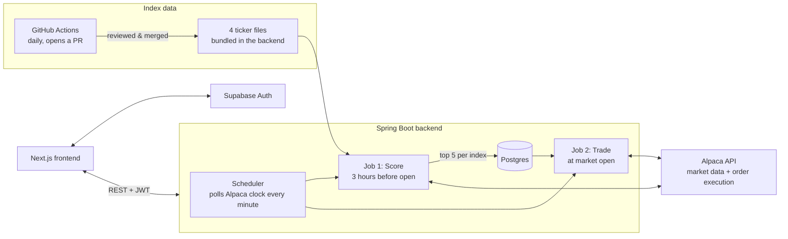

# Momentum Trading System

A daily automated trading system for four US stock indexes — S&P 500, S&P 400, S&P 600, and Nasdaq 100. Every trading day, before the market opens, it scores every stock in those indexes on momentum, ranks them, and picks the top 5 for each index. When the market opens, it rebalances every connected user's account to match the top 5 for whichever index they've chosen. No manual buying or selling — you connect an Alpaca paper trading account, pick an index, and the system does the rest.

It trades with fake money. Alpaca's paper trading API simulates real market execution without touching real cash.

## How it works



Two jobs run automatically every trading day, both driven off Alpaca's own market clock rather than a fixed clock time (since market open shifts around holidays):

- **Job 1** fires once, sometime in the 3 hours before the market opens. It scores every stock across the four indexes and stores the top 5 per index.
- **Job 2** fires once, right when the market opens — but only if Job 1 actually succeeded that same day. It goes through every user who has an Alpaca key, a selected index, and an investment amount set, and rebalances their account to match that index's top 5.

```
 market open − 3h                          market open
        │                                        │
        ▼                                        ▼
   ┌─────────┐                             ┌──────────┐
   │  Job 1  │  scores all 4 indexes  ───▶ │  Job 2   │  rebalances every
   │ Scoring │  writes top 5 each          │ Trading  │  eligible user
   └─────────┘                             └──────────┘
```

Both jobs remember whether they already ran today in a database table (`scheduler_state`), not just in memory — so a backend restart between the two jobs can't cause the whole day to silently get skipped.

## The algorithm

For each stock, using 6 months of daily price data:

- **6-month return** — price now vs. price 6 months ago
- **3-month return** — price now vs. price 3 months ago
- **1-month return** — price now vs. price 1 month ago
- **3-month volatility** — standard deviation of daily returns over the last 3 months (this is the risk penalty)

```
score = 0.5 × ret_6m + 0.3 × ret_3m + 0.2 × ret_1m − 0.1 × vol_3m
```

Longer-term trend matters most, recent momentum matters some, and a stock that's been jumping around a lot gets docked for it. Within each index, stocks are sorted by this score and the top 5 win.

A few things the scoring job checks before trusting its own output:

- **Split-adjusted prices.** Bars are fetched with Alpaca's split adjustment applied, so a stock split doesn't look like a 50% overnight crash or spike.
- **Minimum history.** A stock needs at least 3 months of price data to be scored at all — newly listed stocks get skipped rather than mis-scored off a too-short window.
- **A 90% completion threshold.** If fewer than 90% of the ~1,500-stock universe scores successfully (Alpaca hiccup, network issue, whatever), the whole run is thrown out and treated as failed. Yesterday's recommendations stay in place instead of getting overwritten with a partial, unreliable result.
- **Atomic writes.** The old recommendations get deleted and the new ones get inserted in a single database transaction — the table is never left half-empty if something crashes mid-write.

The universe being scored is the union of all 4 index constituent lists — about 1,500 unique tickers — filtered down to whatever Alpaca actually lists as active and tradable that day. Full market scoring across the entire US stock market was tried and dropped; scoring ~13,000 stocks to only ever recommend from ~1,500 of them wasn't worth the time it took.

## Index data — no live third-party dependency

The four ticker lists (`backend/src/main/resources/index-constituents/*.txt`) are committed to this repo, not fetched over the network at runtime. The backend just reads them off the classpath on startup.

A separate script, `scripts/update_index_constituents.py`, keeps them current. It pulls from:

- **S&P 500, S&P 400, S&P 600** — State Street's official daily holdings disclosures for the SPY, MDY, and SPSM ETFs (`ssga.com`), since those funds track these indexes exactly and publish their real holdings every day.
- **Nasdaq 100** — SlickCharts' constituents table.

A GitHub Actions workflow (`.github/workflows/update-index-constituents.yml`) runs this script daily and opens a pull request if anything changed. Nothing auto-merges — a human reviews the diff before it can affect a live deploy. If a source is unreachable or returns something that looks broken, the script writes nothing and fails loudly instead of guessing.

This used to work differently: the backend fetched CSVs directly from other people's GitHub repos at startup and once a day after that. One of those repos went 224 days without a single commit before anyone noticed. Now the running app has no dependency on any of that infrastructure being up — a bad or stale source shows up as a red CI run, not a production incident.

## Auto trading

For every user with an Alpaca key, a selected index, and an investment amount:

1. Fetch their live positions directly from Alpaca (not from our own database — Alpaca is the source of truth for what someone actually holds).
2. Compare against today's top 5 for their selected index.
3. Sell whatever they're holding that dropped out of the top 5.
4. Buy whatever's newly in the top 5.
5. Leave everything else untouched.

Buy sizing takes a 10% safety buffer off the investment amount, then splits what's left evenly across all 5 target positions — not just the ones being newly bought — so a stock rotating into the top 5 gets sized the same as one that's been there for weeks.

Orders wait up to 24 seconds for a fill before giving up on watching. If an order fills, it's recorded as `FILLED` with the real price and quantity. If it doesn't fill in time, it's recorded as `PENDING` with whatever's actually known (never a fake $0 or 0 shares). If placing the order fails outright, it's recorded as `FAILED`. Trade history always reflects reality, not a guess.

Switching your selected index sells everything you currently hold, then buys the new index's top 5. If you switch outside market hours, the preference is saved immediately and the sell/buy happens automatically the next time the market opens and the scheduler runs — you don't get an error just for changing your mind after hours.

## The user journey

1. **Sign up / log in** — handled entirely by Supabase, email and password.
2. **Connect Alpaca** — first login with no saved key redirects to a one-time onboarding screen asking for an Alpaca paper trading API key and secret.
3. **Set an investment amount and pick an index** — both live on the Settings page. Auto-trading and index switching are both blocked until an investment amount is set.
4. **Browse recommendations** — a user without an Alpaca key can still see today's top 5 for any index; they just can't trade until they connect an account.
5. **Sit back** — once a key, index, and investment amount are all set, the scheduler takes it from there every trading day.
6. **Check the dashboard** — portfolio value, today's top 5 for your index, and recent auto-trade history.

## Tech stack

**Backend**
- Java 21, Spring Boot 3.3.4
- PostgreSQL (Supabase-hosted), Hibernate/JPA
- [alpaca-java](https://github.com/Petersoj/alpaca-java) for market data and order execution
- Supabase for auth (the backend validates bearer tokens against Supabase's API on every request)

**Frontend**
- Next.js 16 (App Router), React 19
- Tailwind CSS 4, shadcn/ui (built on Base UI)
- TanStack React Query
- Supabase JS client for login/session management

**Infra**
- Backend on Render, frontend on Vercel
- GitHub Actions for the daily index data update

## Running it locally

You'll need Java 21, Node.js, and a Postgres database (Supabase works fine, or any Postgres instance).

**Backend**

```bash
cd backend
# create a .env file in this folder — see Environment variables below
mvn spring-boot:run
```

Starts on `http://localhost:8080`.

**Frontend**

```bash
cd frontend
npm install
# create a .env.local file in this folder — see Environment variables below
npm run dev
```

Starts on `http://localhost:3000`.

## Environment variables

**Backend** (`backend/.env`)

```
ALPACA_SYSTEM_API_KEY=
ALPACA_SYSTEM_API_SECRET=
DB_URL=
DB_USERNAME=
DB_PASSWORD=
MAIL_HOST=
MAIL_PORT=
MAIL_USERNAME=
MAIL_PASSWORD=
SUPABASE_URL=
SUPABASE_ANON_KEY=
ADMIN_SECRET_KEY=
```

- `ALPACA_SYSTEM_API_KEY` / `ALPACA_SYSTEM_API_SECRET` are used only to fetch market data for scoring — this key never places a trade. Each user's own Alpaca key, entered during onboarding, is what actually trades their account.
- `ADMIN_SECRET_KEY` gates every `/admin/**` endpoint — requests need an `X-Admin-Key` header matching this value.
- The `MAIL_*` variables are read at startup because `spring-boot-starter-mail` is on the classpath, but nothing in the app currently sends email. Any values work if you're not using mail.
- One thing worth knowing: Alpaca keys are currently stored in plaintext, not encrypted — fine for paper trading keys in a project like this, but worth knowing before pointing it at anything more sensitive.

**Frontend** (`frontend/.env.local`)

```
NEXT_PUBLIC_SUPABASE_URL=
NEXT_PUBLIC_SUPABASE_ANON_KEY=
NEXT_PUBLIC_API_BASE_URL=
```

## API endpoints

All endpoints except `/admin/**` require a Supabase JWT in the `Authorization: Bearer <token>` header. `/admin/**` requires an `X-Admin-Key` header instead.

| Method | Endpoint | What it does |
|---|---|---|
| GET | `/me` | Returns the current user, auto-creating a bare record on first call |
| PUT | `/users/me/alpaca-key` | Saves or replaces the user's Alpaca API key/secret |
| PUT | `/users/me/investment-amount` | Sets how much to invest per rebalance cycle |
| POST | `/users/me/selected-index` | Sets which index to follow; sells and rebuys if the market's open |
| GET | `/recommendations/snp500` | Today's top 5 for the S&P 500 |
| GET | `/recommendations/sp400` | Today's top 5 for the S&P 400 |
| GET | `/recommendations/sp600` | Today's top 5 for the S&P 600 |
| GET | `/recommendations/nasdaq100` | Today's top 5 for the Nasdaq 100 |
| GET | `/recommendations/full-market` | Today's top 5 across the whole scored universe |
| GET | `/:userId/account` | Live cash, buying power, and portfolio value from Alpaca |
| GET | `/:userId/positions` | Live positions from Alpaca |
| GET | `/:userId/daily-trades` | This user's auto-trade history |
| GET | `/admin/metrics` | System health, last scoring run, trade counts |
| POST | `/admin/run-daily-scoring` | Manually triggers Job 1 |
| POST | `/admin/run-daily-trading` | Manually triggers Job 2 |

`:userId` endpoints check that the authenticated caller actually owns that user ID — you can't read or trade on someone else's account by changing a number in the URL.

## What's next

- The `MAIL_*` config exists but nothing sends email yet — no trade confirmations, no alerts.
- No automated tests. Everything's been verified by hand against the live Alpaca paper API this far.
- The daily scoring job takes a few seconds to a couple of minutes depending on Alpaca's response times — there's no live progress indicator on the frontend while it runs.
