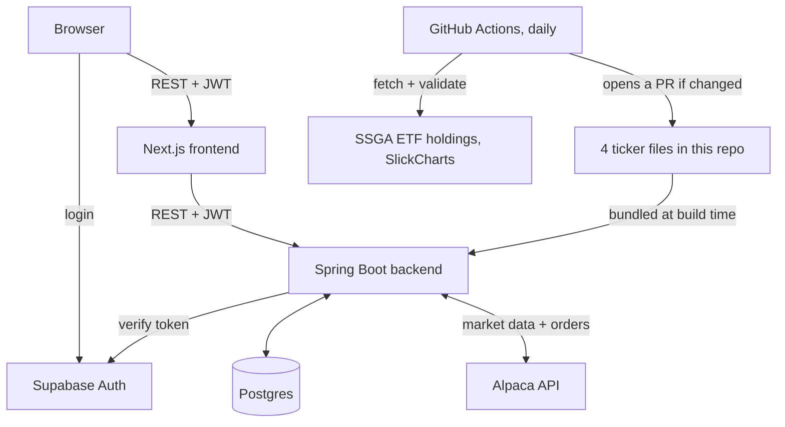
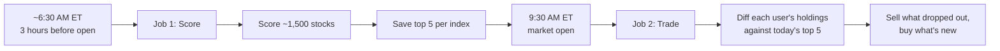
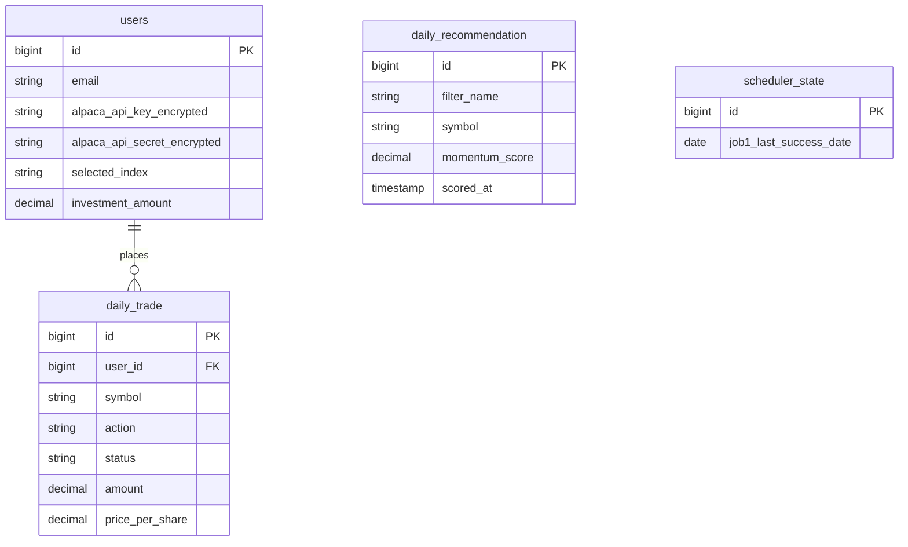

# Momentum Trading System

I built a system that trades stocks on its own, every day, based on price momentum. It scores around 1,500 stocks across four US indexes every morning before the market opens, picks the top 5 per index, and rebalances every connected user's account to match — no button to click, no manual approval step. The hard part was never the scoring formula. It was making a background job that fires at the right time every single day without a hardcoded clock, making sure a crash mid-write never corrupts a day's recommendations, and closing a real authorization hole where any logged-in user could trade on someone else's account. All three are covered below with the actual bugs and the actual fixes.

It trades with fake money — Alpaca's paper trading API — so the mechanics are real but nothing here risks real cash.

## System architecture



The frontend never talks to Alpaca or Postgres directly. Everything goes through the backend, which checks the caller's Supabase token on every request. Index constituent data doesn't come from a live API call at request time at all — it's four text files built into the backend, kept current by a separate scheduled job. More on why below.

## Daily trading engine flow

Two jobs run automatically every trading day. Neither runs on a fixed clock time — both are driven off Alpaca's own market calendar, because market open shifts around holidays and I didn't want a hardcoded 9:30 AM breaking every time there's a holiday schedule.



A background poller checks Alpaca's clock every 60 seconds. Job 1 fires once, somewhere in the 3-hour window before open — a window, not one exact minute, so a slow poll can't cause the whole day to get skipped. Job 2 fires once, right at open, but only if Job 1 actually succeeded that same day. If scoring failed or never ran, trading sits out rather than rebalancing against yesterday's data.

## Momentum algorithm

For every stock, using 6 months of split-adjusted daily bars:

```
score = 0.5 × return_6m + 0.3 × return_3m + 0.2 × return_1m − 0.1 × volatility_3m
```

- **return_6m / return_3m / return_1m** — percent price change over each window. This is the trend.
- **volatility_3m** — standard deviation of daily returns over the last 3 months. This is the risk penalty. A stock that's been jumping around a lot gets docked, even if the trend is up.

Two real stocks, scored on a real run this week:

| Symbol | 6m return | 3m return | 1m return | 3m volatility | Score |
|---|---|---|---|---|---|
| MRNA | +160.9% | +205.7% | +170.1% | 0.232 | **1.7385** |
| MXL | +294.6% | −20.8% | −10.6% | 0.084 | **1.3808** |

I picked these two and recomputed the formula by hand against the raw Alpaca bar data to check the stored score matched. It did, to six decimal places. MXL is the more interesting one — a huge 6-month gain but negative momentum over the last 1 and 3 months. The formula still ranks it above stocks with a smoother but smaller trend, because the 6-month term carries half the weight. Whether that's the right call is a fair question — it's a simple weighted formula, not a claim that it's optimal.

Before scoring, a stock has to clear two checks: at least 3 months of price history (a newly listed stock with two weeks of data would get its short window treated as a full 6-month return otherwise), and the run itself has to score at least 90% of the ~1,500-stock universe or the whole run gets thrown out. More on that below.

## Database schema



Only `daily_trade` links to `users` — every trade belongs to someone. `daily_recommendation` is global: it's today's top 5 for each index, the same for every user, wiped and rewritten each morning. `scheduler_state` is a single row that survives restarts (why that matters is below).

## API endpoints

Every route needs a Supabase JWT in `Authorization: Bearer <token>`, except `/admin/**`, which needs `X-Admin-Key` instead.

| Method | Endpoint | What it does |
|---|---|---|
| GET | `/me` | Current user, auto-created on first call |
| PUT | `/users/me/alpaca-key` | Save or replace the Alpaca key |
| PUT | `/users/me/investment-amount` | Set how much to invest per rebalance |
| POST | `/users/me/selected-index` | Change tracked index, sells + rebuys if the market's open |
| GET | `/recommendations/snp500` | Today's top 5, S&P 500 |
| GET | `/recommendations/sp400` | Today's top 5, S&P 400 |
| GET | `/recommendations/sp600` | Today's top 5, S&P 600 |
| GET | `/recommendations/nasdaq100` | Today's top 5, Nasdaq 100 |
| GET | `/recommendations/full-market` | Today's top 5 across the whole scored universe |
| GET | `/:userId/account` | Live cash, buying power, portfolio value |
| GET | `/:userId/positions` | Live positions from Alpaca |
| GET | `/:userId/daily-trades` | This user's trade history |
| GET | `/admin/metrics` | Health, last scoring run, trade counts |
| POST | `/admin/run-daily-scoring` | Manually trigger Job 1 |
| POST | `/admin/run-daily-trading` | Manually trigger Job 2 |

Every `:userId` route checks that the caller's token actually belongs to that user. That wasn't always true — see below.

## Key technical decisions

**Spring Boot over a lighter framework.** I needed `@Scheduled` polling and a mature JPA layer for the trade audit trail, and Alpaca's official SDK is Java. Fighting the ecosystem to save startup time wasn't worth it for a background job service.

**Postgres through Supabase, not a separate auth provider.** I needed real foreign keys and transactions — the atomic-write fix below depends on them — and I didn't want to build password reset flows and session handling myself. Supabase gives me both a real Postgres database and auth under one project.

**Alpaca for both data and execution.** Scoring and trading both read from the same API. If I'd pulled prices from one provider and traded through another, a price mismatch between the two becomes a silent correctness bug instead of an obvious one.

**React Query on the frontend.** Every mutation — buy, sell, switch index — changes account state that three other parts of the UI depend on: positions, recommendations, the dashboard. Query invalidation after a mutation is a built-in pattern in React Query. Rolling my own cache invalidation for that many dependent views wasn't worth it.

**Text files instead of a live API for index membership.** Covered in full below, but the short version: I stopped trusting any external source to be up when my scheduler runs, and stopped trusting the running app to fetch this data correctly at all.

## Challenges faced and how I solved them

**The index constituent problem.** I originally pulled S&P 500/400/600 and Nasdaq 100 constituent lists from four different community GitHub repos, fetched live every day. During a review I found the Nasdaq 100 source had gone 224 days without a single commit — not stale data, an abandoned repo. I looked at switching to Wikipedia and found its Nasdaq-100 page doesn't even have a constituent table anymore, which is probably why the original scraper broke and nobody noticed. I stopped fetching this data at runtime entirely. Now it's four text files committed to this repo, read straight off the classpath, no network call involved. A GitHub Actions job runs daily, pulls from State Street's own official ETF holdings disclosures for the S&P indexes and SlickCharts for Nasdaq 100, and opens a pull request if anything changed. Nothing auto-merges. If a source breaks now, I see a failed CI run — the live app never notices, because it was never involved.

**Performance.** The first version scored every active US stock — around 13,400 of them — every day. Runs took anywhere from 76 to over 370 seconds, and the variance alone made me distrust the number. But the app only ever recommends from four indexes, roughly 1,500 unique tickers after removing overlap. I cut the universe down to that, fetched bars in batches of 200 symbols per request instead of one at a time, and ran the batches in parallel. Real runs now finish in single digits to low teens of seconds.

**The IDOR bug.** I was auditing the API surface and noticed `/{userId}/account`, `/{userId}/trade/buy`, and every other `:userId` route trusted the number in the URL with no check against who was actually logged in. Any authenticated user could read or trade on any other user's account by changing one digit. The JWT filter was validating tokens but throwing away the identity it resolved — it never reached the controllers. I fixed it by storing the resolved email as the request's security principal and adding an ownership check to every route that takes a `userId`. I verified it by creating two real throwaway accounts and confirming user A got a 403 touching user B's data, and that A's own requests still worked.

**Atomic writes.** The scoring job replaces yesterday's recommendations by deleting every row and inserting the new ones — two separate database calls. They weren't wrapped in one transaction. A crash between the delete and the insert would leave the table completely empty instead of keeping yesterday's data, which was the entire point of having a "keep old data on failure" safeguard elsewhere in the same method. I wrapped both calls in a single transaction. To check it actually worked, I ran the exact failure case against the real database — delete, then a deliberately broken insert, both inside one transaction — and confirmed the original rows were still there after the rollback.

**Market timing.** `@Scheduled(cron = ...)` needs a fixed time, and market open isn't fixed — it moves around holidays. I built a poller that checks Alpaca's live clock every 60 seconds instead. It also turned out the "did Job 1 run today" flag only lived in memory. A restart between Job 1 succeeding and Job 2 firing would silently skip the entire trading day for every user, with nothing in the logs to explain why. I moved that state into a database row that gets reloaded on startup.

**One more, smaller but real: buy-sizing math.** When a stock rotated out of someone's top 5 and a new one rotated in, the new one was sized using the full day's investment amount divided by however many stocks were new that day — not divided by 5. One new stock replacing one old one meant the new position got sized as if it were the only holding, instead of matching the other four. Fixed by always dividing by the full target count, not just the count of what's new.

## Tech stack

| Layer | Choice |
|---|---|
| Backend | Java 21, Spring Boot 3.3.4 |
| Database | PostgreSQL via Supabase, Hibernate/JPA |
| Market data + execution | Alpaca (alpaca-java SDK) |
| Auth | Supabase Auth |
| Frontend | Next.js 16, React 19 |
| UI | Tailwind CSS 4, shadcn/ui |
| Data fetching | TanStack React Query |
| Index data pipeline | Python script + GitHub Actions |
| Hosting | Render (backend), Vercel (frontend) |

## Local setup

Need Java 21, Node.js, and a Postgres database.

**Backend**

```bash
cd backend
# create .env — see variables below
mvn spring-boot:run
```

Runs on `http://localhost:8080`.

**Frontend**

```bash
cd frontend
npm install
# create .env.local — see variables below
npm run dev
```

Runs on `http://localhost:3000`.

**Backend `.env`**

```
ALPACA_SYSTEM_API_KEY=
ALPACA_SYSTEM_API_SECRET=
DB_URL=
DB_USERNAME=
DB_PASSWORD=
MAIL_HOST=
MAIL_PORT=
MAIL_USERNAME=
MAIL_PASSWORD=
SUPABASE_URL=
SUPABASE_ANON_KEY=
ADMIN_SECRET_KEY=
```

`ALPACA_SYSTEM_API_KEY` is only used to fetch market data for scoring — it never places a trade. Each user's own key, entered during onboarding, is what trades their account. `ADMIN_SECRET_KEY` gates every `/admin/**` route. The `MAIL_*` variables have to be set for the app to start (Spring's mail autoconfiguration reads them) but nothing currently sends email — any values work.

One honest gap: Alpaca keys are stored in plaintext right now, not encrypted. Fine for paper trading keys in a project like this. Not something I'd ship with real brokerage credentials.

**Frontend `.env.local`**

```
NEXT_PUBLIC_SUPABASE_URL=
NEXT_PUBLIC_SUPABASE_ANON_KEY=
NEXT_PUBLIC_API_BASE_URL=
```
