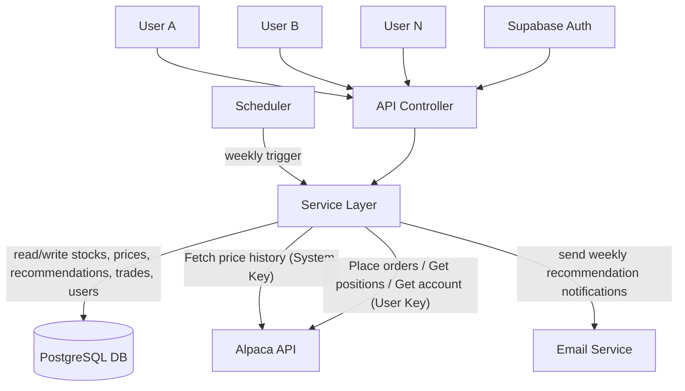

# Architecture Diagram

```mermaid
graph TD
    UserA[User A]
    UserB[User B]
    UserN[User N]

    Auth[Supabase Auth]
    Controller[API Controller]
    Scheduler[Scheduler]
    Service[Service Layer]
    DB[(PostgreSQL DB)]
    Alpaca[Alpaca API]
    Email[Email Service]

    UserA --> Controller
    UserB --> Controller
    UserN --> Controller

    Auth --> Controller

    Scheduler -->|weekly trigger| Service
    Controller --> Service

    Service -->|read/write stocks, prices, recommendations, trades, users| DB

    Service -->|"Fetch price history (System Key)"| Alpaca
    Service -->|"Place orders / Get positions / Get account (User Key)"| Alpaca

    Service -->|send weekly recommendation notifications| Email
```
