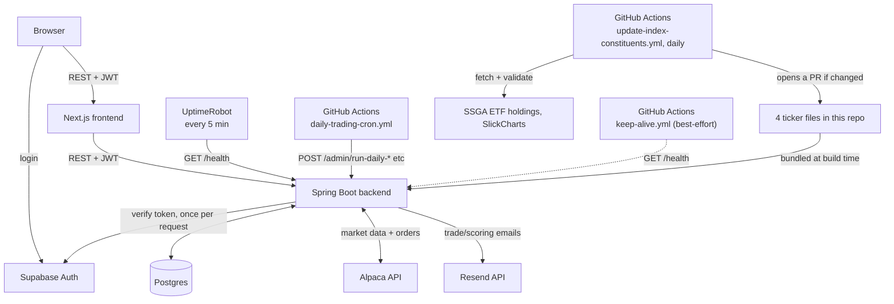

# Architecture Diagram

The frontend never talks to Alpaca, Postgres, or Resend directly — everything goes through the backend, which checks the caller's Supabase token once per request. Index constituent data isn't fetched live at request time at all; it's four text files built into the backend, kept current by a separate scheduled job that opens a PR rather than auto-merging.

Three separate things ping or trigger the backend on a schedule: UptimeRobot and `keep-alive.yml` exist purely to stop Render's free tier from sleeping (only UptimeRobot actually delivers on its interval — GitHub throttles high-frequency cron on this repo to every few hours), and `daily-trading-cron.yml` is the one that actually matters: it calls the admin endpoints directly, which both wakes the backend and runs the job in the same request, independent of whether anything else kept it warm. The in-process scheduler (not shown above — see the daily flow diagram) is the primary trigger when the backend is already awake; these three are what keep the system reliable when it isn't.
