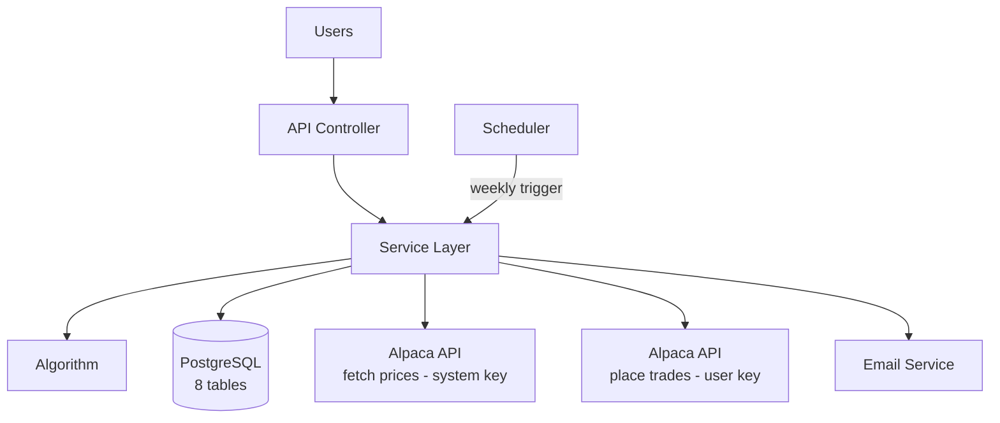

# Architecture Diagram

```mermaid
flowchart TD
    Users[Users]
    Scheduler[Scheduler]
    Controller[API Controller]
    Service[Service Layer]
    Algorithm[Algorithm]
    DB[(PostgreSQL<br/>8 tables)]
    AlpacaFetch[Alpaca API<br/>fetch prices - system key]
    AlpacaTrade[Alpaca API<br/>place trades - user key]
    Email[Email Service]

    Users --> Controller
    Controller --> Service
    Service --> Algorithm
    Scheduler -->|weekly trigger| Service

    Service --> DB
    Service --> AlpacaFetch
    Service --> AlpacaTrade
    Service --> Email
```
