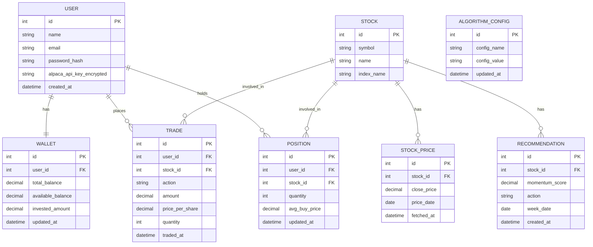

# Schema Diagram

```mermaid
erDiagram
    USER ||--|| WALLET : has
    USER ||--o{ TRADE : places
    USER ||--o{ POSITION : holds
    STOCK ||--o{ STOCK_PRICE : has
    STOCK ||--o{ RECOMMENDATION : has
    STOCK ||--o{ TRADE : involved_in
    STOCK ||--o{ POSITION : involved_in

    USER {
        int id PK
        string name
        string email
        string password_hash
        string alpaca_api_key_encrypted
        datetime created_at
    }

    WALLET {
        int id PK
        int user_id FK
        decimal total_balance
        decimal available_balance
        decimal invested_amount
        datetime updated_at
    }

    STOCK {
        int id PK
        string symbol
        string name
        string index_name
    }

    STOCK_PRICE {
        int id PK
        int stock_id FK
        decimal close_price
        date price_date
        datetime fetched_at
    }

    ALGORITHM_CONFIG {
        int id PK
        string config_name
        string config_value
        datetime updated_at
    }

    RECOMMENDATION {
        int id PK
        int stock_id FK
        decimal momentum_score
        string action
        date week_date
        datetime created_at
    }

    TRADE {
        int id PK
        int user_id FK
        int stock_id FK
        string action
        decimal amount
        decimal price_per_share
        int quantity
        datetime traded_at
    }

    POSITION {
        int id PK
        int user_id FK
        int stock_id FK
        int quantity
        decimal avg_buy_price
        datetime updated_at
    }
```
