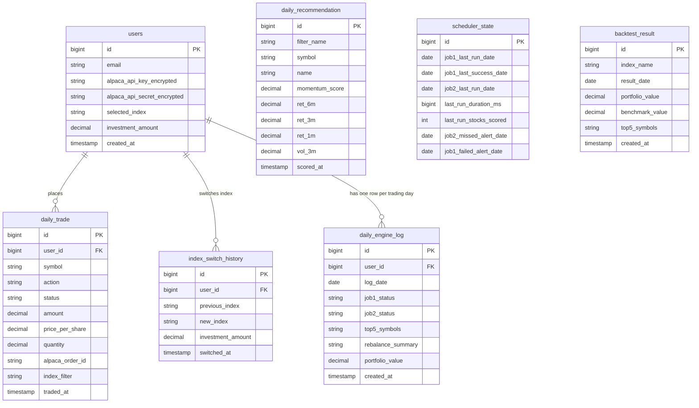

# Schema Diagram

`daily_trade`, `index_switch_history`, and `daily_engine_log` all link to `users` — every trade, index switch, and daily log entry belongs to someone. `daily_recommendation` is global, not per user: it's today's top 5 for each index (`filter_name`), the same for every user tracking that index, wiped and rewritten each morning Job 1 succeeds.

`daily_engine_log` gets one row per user per trading day (unique on `user_id` + `log_date`) regardless of outcome — a day with zero trades still gets a row saying why (market closed, holdings already matched, or a real failure), instead of a gap that looks identical to "the system never ran."

`scheduler_state` is a single row (`id = 1`) that survives restarts. `job1_last_run_date`/`job1_last_success_date` and `job2_last_run_date` are what let three independent trigger paths (in-process poller, external cron, manual admin call) all safely check "did today's job already happen" without racing each other. `job2_missed_alert_date` makes sure the "trading window missed" email only ever sends once per day; `job1_failed_alert_date` is the same guard for the "scoring failed today" email.

`backtest_result` is also global, like `daily_recommendation` — no `users` link, unique on (`index_name`, `result_date`). Written only by `scripts/backtest.py`, a separate daily process outside this Spring Boot app — never by the backend itself, which only ever reads it.
