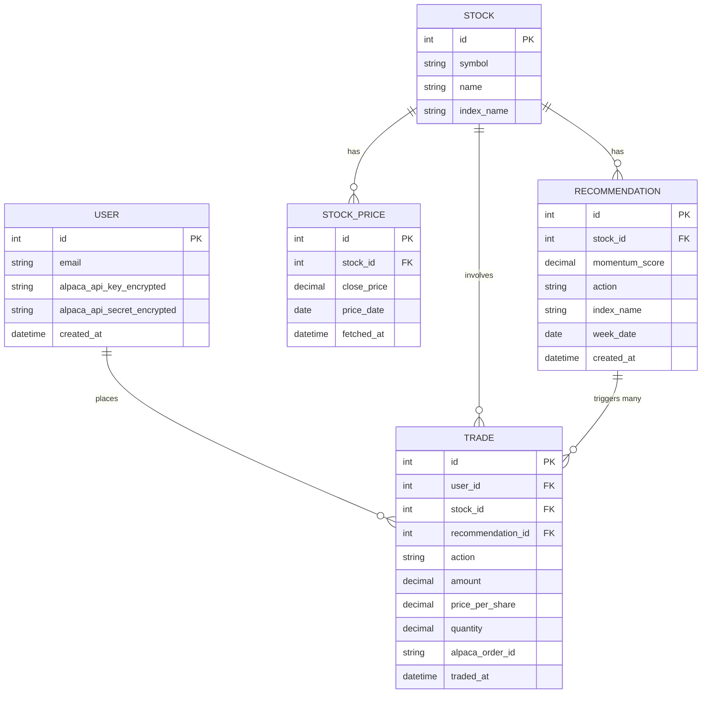

# Schema Diagram

```mermaid
erDiagram
    USER ||--o{ TRADE : places
    STOCK ||--o{ STOCK_PRICE : has
    STOCK ||--o{ RECOMMENDATION : has
    STOCK ||--o{ TRADE : involves
    RECOMMENDATION ||--o{ TRADE : "triggers many"

    USER {
        int id PK
        string email
        string alpaca_api_key_encrypted
        string alpaca_api_secret_encrypted
        datetime created_at
    }

    STOCK {
        int id PK
        string symbol
        string name
        string index_name
    }

    STOCK_PRICE {
        int id PK
        int stock_id FK
        decimal close_price
        date price_date
        datetime fetched_at
    }

    RECOMMENDATION {
        int id PK
        int stock_id FK
        decimal momentum_score
        string action
        string index_name
        date week_date
        datetime created_at
    }

    TRADE {
        int id PK
        int user_id FK
        int stock_id FK
        int recommendation_id FK
        string action
        decimal amount
        decimal price_per_share
        decimal quantity
        string alpaca_order_id
        datetime traded_at
    }
```
