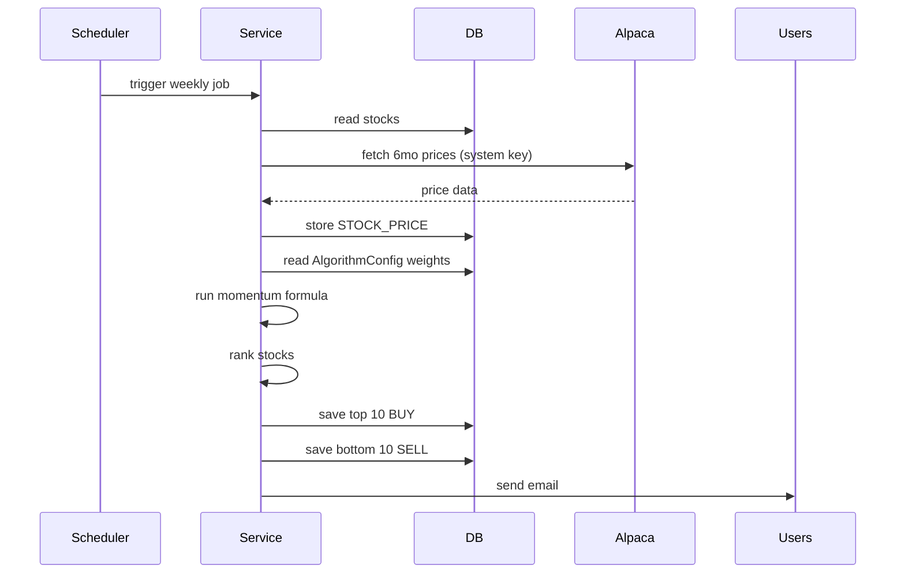
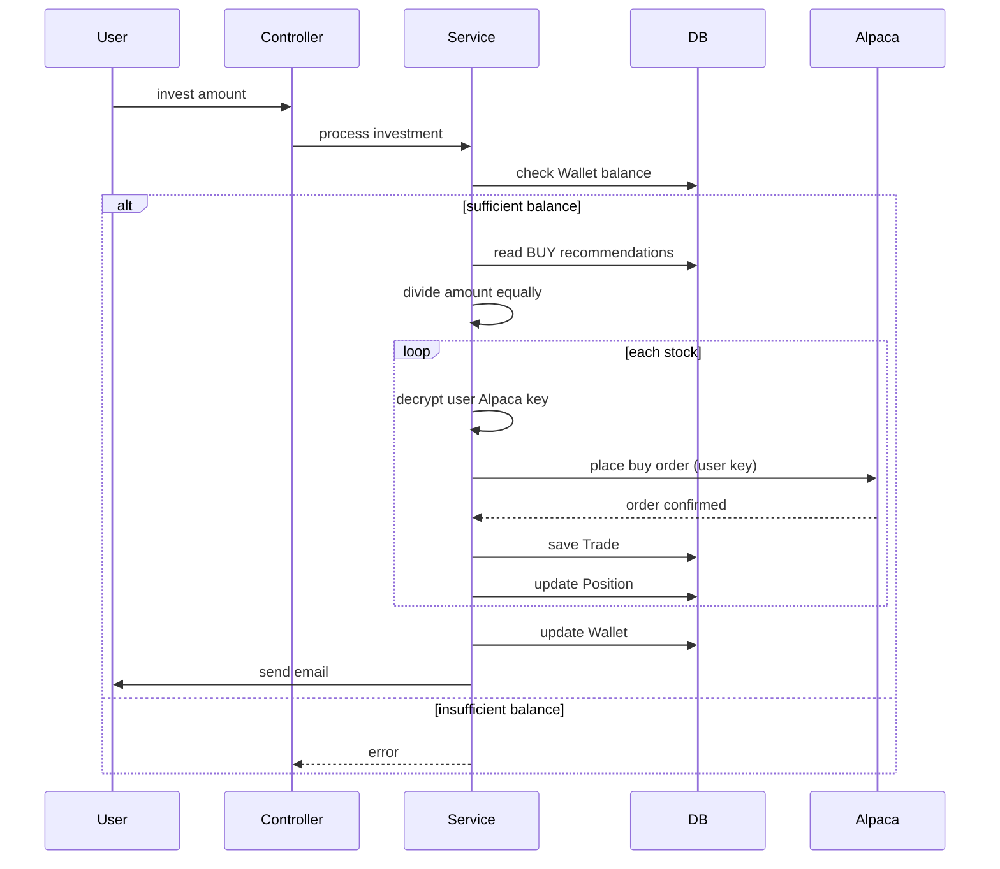
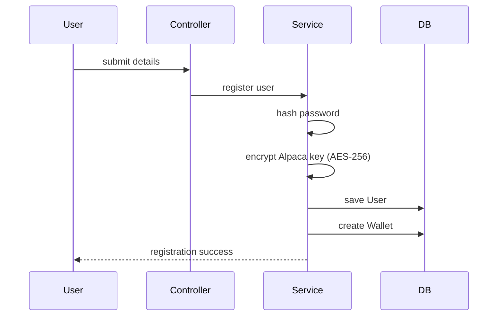
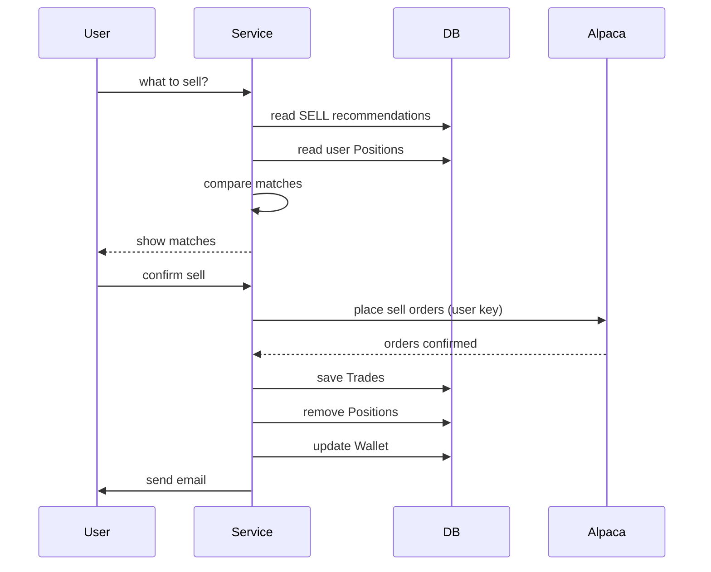

# Sequence Diagrams

## 1. Weekly Recommendation Flow

```mermaid
sequenceDiagram
    participant Scheduler
    participant Service
    participant DB
    participant Alpaca

    Scheduler->>Service: trigger weekly job
    Service->>DB: read stocks
    Service->>Alpaca: fetch 6mo prices (system key)
    Alpaca-->>Service: price data
    Service->>DB: store STOCK_PRICE
    Service->>DB: read AlgorithmConfig weights
    Service->>Service: run momentum formula
    Service->>Service: rank stocks
    Service->>DB: save top 10 BUY
    Service->>DB: save bottom 10 SELL
    Service->>Users: send email
```

## 2. User Investment Flow

```mermaid
sequenceDiagram
    participant User
    participant Controller
    participant Service
    participant DB
    participant Alpaca

    User->>Controller: invest amount
    Controller->>Service: process investment
    Service->>DB: check Wallet balance
    alt sufficient balance
        Service->>DB: read BUY recommendations
        Service->>Service: divide amount equally
        loop each stock
            Service->>Service: decrypt user Alpaca key
            Service->>Alpaca: place buy order (user key)
            Alpaca-->>Service: order confirmed
            Service->>DB: save Trade
            Service->>DB: update Position
        end
        Service->>DB: update Wallet
        Service->>User: send email
    else insufficient balance
        Service-->>Controller: error
    end
```

## 3. User Registration Flow

```mermaid
sequenceDiagram
    participant User
    participant Controller
    participant Service
    participant DB

    User->>Controller: submit details
    Controller->>Service: register user
    Service->>Service: hash password
    Service->>Service: encrypt Alpaca key (AES-256)
    Service->>DB: save User
    Service->>DB: create Wallet
    Service-->>User: registration success
```

## 4. Weekly Sell Flow

```mermaid
sequenceDiagram
    participant User
    participant Service
    participant DB
    participant Alpaca

    User->>Service: what to sell?
    Service->>DB: read SELL recommendations
    Service->>DB: read user Positions
    Service->>Service: compare matches
    Service-->>User: show matches
    User->>Service: confirm sell
    Service->>Alpaca: place sell orders (user key)
    Alpaca-->>Service: orders confirmed
    Service->>DB: save Trades
    Service->>DB: remove Positions
    Service->>DB: update Wallet
    Service->>User: send email
```
