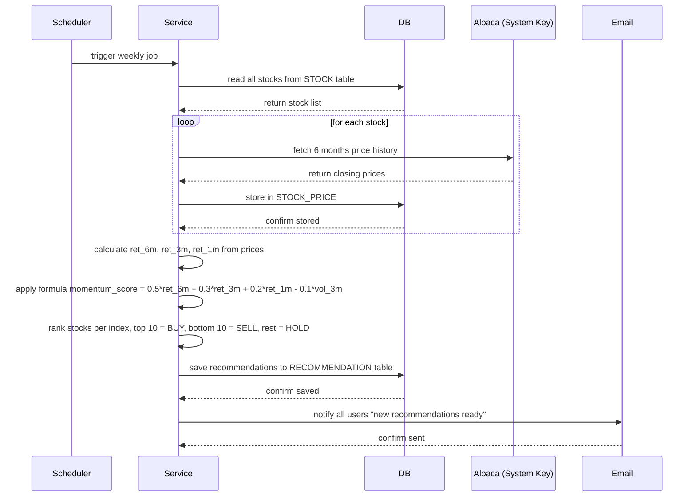
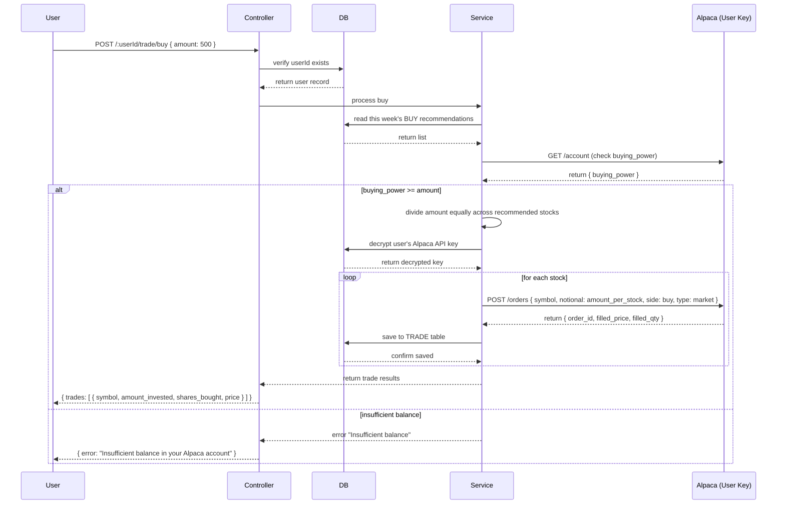
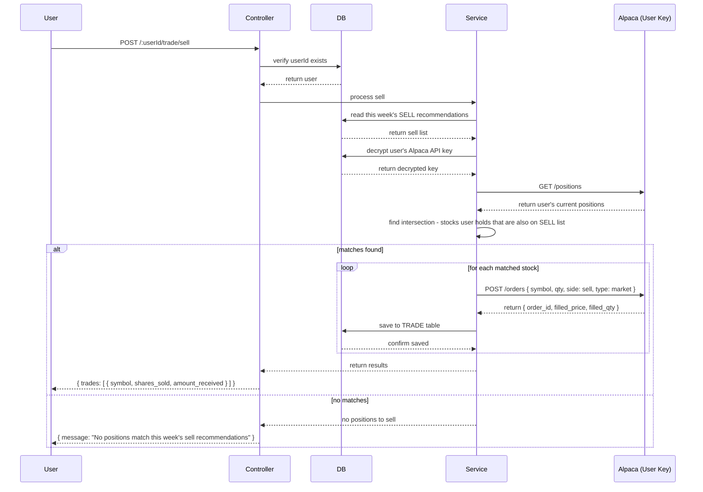
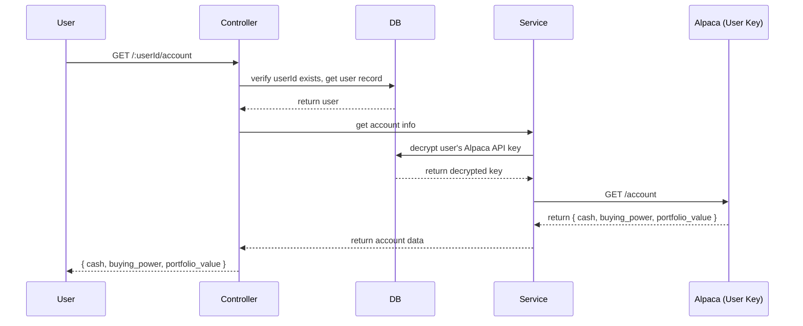

# Sequence Diagrams

## 1. Weekly Recommendation Flow

```mermaid
sequenceDiagram
    participant Scheduler
    participant Service
    participant DB
    participant Alpaca as Alpaca (System Key)
    participant Email

    Scheduler->>Service: trigger weekly job
    Service->>DB: read all stocks from STOCK table
    DB-->>Service: return stock list

    loop for each stock
        Service->>Alpaca: fetch 6 months price history
        Alpaca-->>Service: return closing prices
        Service->>DB: store in STOCK_PRICE
        DB-->>Service: confirm stored
    end

    Service->>Service: calculate ret_6m, ret_3m, ret_1m from prices
    Service->>Service: apply formula momentum_score = 0.5*ret_6m + 0.3*ret_3m + 0.2*ret_1m - 0.1*vol_3m
    Service->>Service: rank stocks per index, top 10 = BUY, bottom 10 = SELL, rest = HOLD

    Service->>DB: save recommendations to RECOMMENDATION table
    DB-->>Service: confirm saved

    Service->>Email: notify all users "new recommendations ready"
    Email-->>Service: confirm sent
```

## 2. User Buy Flow

```mermaid
sequenceDiagram
    participant User
    participant Controller
    participant DB
    participant Service
    participant Alpaca as Alpaca (User Key)

    User->>Controller: POST /:userId/trade/buy { amount: 500 }
    Controller->>DB: verify userId exists
    DB-->>Controller: return user record
    Controller->>Service: process buy

    Service->>DB: read this week's BUY recommendations
    DB-->>Service: return list

    Service->>Alpaca: GET /account (check buying_power)
    Alpaca-->>Service: return { buying_power }

    alt buying_power >= amount
        Service->>Service: divide amount equally across recommended stocks
        Service->>DB: decrypt user's Alpaca API key
        DB-->>Service: return decrypted key

        loop for each stock
            Service->>Alpaca: POST /orders { symbol, notional: amount_per_stock, side: buy, type: market }
            Alpaca-->>Service: return { order_id, filled_price, filled_qty }
            Service->>DB: save to TRADE table
            DB-->>Service: confirm saved
        end

        Service-->>Controller: return trade results
        Controller-->>User: { trades: [ { symbol, amount_invested, shares_bought, price } ] }
    else insufficient balance
        Service-->>Controller: error "Insufficient balance"
        Controller-->>User: { error: "Insufficient balance in your Alpaca account" }
    end
```

## 3. User Sell Flow

```mermaid
sequenceDiagram
    participant User
    participant Controller
    participant DB
    participant Service
    participant Alpaca as Alpaca (User Key)

    User->>Controller: POST /:userId/trade/sell
    Controller->>DB: verify userId exists
    DB-->>Controller: return user

    Controller->>Service: process sell

    Service->>DB: read this week's SELL recommendations
    DB-->>Service: return sell list

    Service->>DB: decrypt user's Alpaca API key
    DB-->>Service: return decrypted key

    Service->>Alpaca: GET /positions
    Alpaca-->>Service: return user's current positions

    Service->>Service: find intersection - stocks user holds that are also on SELL list

    alt matches found
        loop for each matched stock
            Service->>Alpaca: POST /orders { symbol, qty, side: sell, type: market }
            Alpaca-->>Service: return { order_id, filled_price, filled_qty }
            Service->>DB: save to TRADE table
            DB-->>Service: confirm saved
        end

        Service-->>Controller: return results
        Controller-->>User: { trades: [ { symbol, shares_sold, amount_received } ] }
    else no matches
        Service-->>Controller: no positions to sell
        Controller-->>User: { message: "No positions match this week's sell recommendations" }
    end
```

## 4. Get Account Info Flow

```mermaid
sequenceDiagram
    participant User
    participant Controller
    participant DB
    participant Service
    participant Alpaca as Alpaca (User Key)

    User->>Controller: GET /:userId/account
    Controller->>DB: verify userId exists, get user record
    DB-->>Controller: return user

    Controller->>Service: get account info
    Service->>DB: decrypt user's Alpaca API key
    DB-->>Service: return decrypted key

    Service->>Alpaca: GET /account
    Alpaca-->>Service: return { cash, buying_power, portfolio_value }

    Service-->>Controller: return account data
    Controller-->>User: { cash, buying_power, portfolio_value }
```
