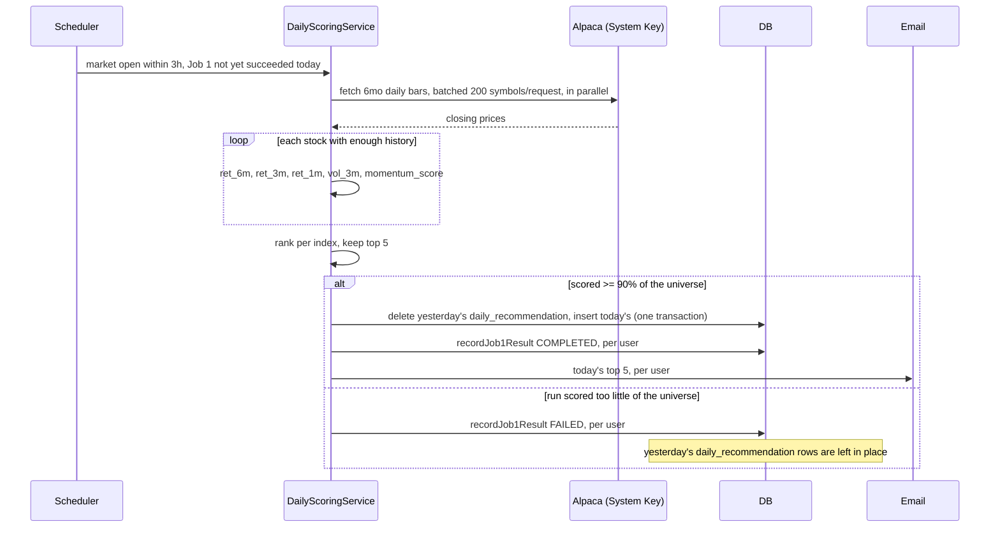
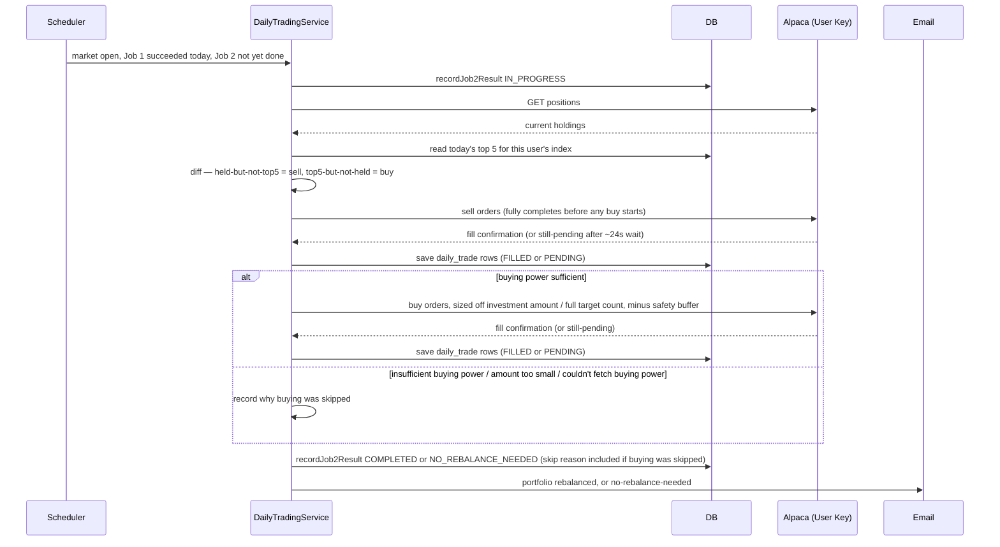
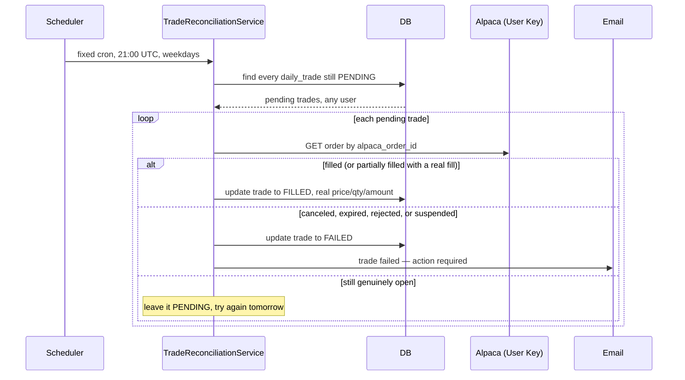

# Sequence Diagrams

The three jobs that run automatically every trading day. Job 1 and Job 2 are triggered by an in-process poller checking Alpaca's own market clock every 60 seconds (not a fixed cron time); Job 3 runs on a plain fixed-time cron, since it only needs to happen well after close.

## 1. Job 1 — Daily Scoring

Retries every 15 minutes within its 3-hour window until it succeeds — the same "keep trying, not one shot" design as Job 2. If the window closes without ever succeeding, every eligible user gets a "Scoring Failed Today" email, mirroring Job 2's "Trading Window Missed" alert.

## 2. Job 2 — Rebalance (per eligible user, run in parallel)

## 3. Job 3 — Reconciliation

